# DIF連續下跌慣性改變買點

> 一句話摘要：DIF值連續下跌（今值皆小於前值）超過23個交易日以上，當它首度止跌上勾、且當根K線是漲幅超過4%的紅K線時，形成可靠度極高的買進訊號，不論多頭或空頭市場皆可適用。

## 1. 核心概念
- MACD指標所呈現的特殊買點結構中，有一種特別的現象：DIF值如果連續性下跌超過23天以上，當它出現上勾轉折時，再配合出現超過4%漲幅的紅K線，形成可靠度極高的買進訊號，不管多頭市場或空頭市場中，皆可適用之（p.155）。
- 所謂DIF連續下跌23天以上，代表23天內DIF值一直維持「今值小於前值」的現象，與價格當天漲跌無關（p.155）。
- 這種買進訊號的原理是基於「慣性的改變」，如同K線慣性操作中所介紹的現象一樣，只是把觀察對象換成指標值：在某段期間指標值始終維持連續推升或連續下跌的狀況，當這種慣性的連續結構被破壞時，通常造成價格反轉（p.155）。MACD指標中DIF不論在金叉向上或死叉向下的狀況，都不容易出現連續推升或連續下跌超過23天以上，正因為這種慣性的連續結構不多見，也創造了它的獨特可靠度（p.155）。
- 什麼狀況下才會出現DIF值連續下跌超過23天以上？必然是價格回檔過程呈現跌多漲少，且上漲的K線力道不足以讓DIF值上勾轉折，造成DIF一路維持「今值小於前值」的現象（p.155）。
- 23天為作者依過去歷史資料驗證後得出的經驗法則："具有神秘的意象"，少於23天並非不能反轉上漲，而是驗證中發現23天最能表現慣性改變後的反轉效果，也是重要的抓波段低點方式（p.161）。

## 2. 適用前提
- 不限多頭或空頭市場皆可適用（p.155）。
- 買訊出現後的持有期間（長線或短線）應依訊號出現的價格位階評估（見第6節）：
  - 若買訊出現在季線及年線黃金交叉的初期，宜採取長線持有，以獲取波段利潤（p.155）。
  - 若買訊出現在高檔區（自最低點上漲超過一倍以上；或某些權值股上漲超過7成），宜採取短打操作（p.155）。
  - 空頭市場中，若買訊出現在自頂點反轉四成以內，宜採取短打性質，可採階梯出場線作為停利依據（p.155）。
  - 若買訊出現在跌勢末期（自頂點反轉達六成以上；某些當年虧損的公司則自頂點下跌八成至九成），只要沒有觸及買進訊號K線7%停損位置，應該採取長線持有（p.155）。

## 3. 訊號定義（多方）
1. DIF值連續下跌超過23個交易日以上，即連續23天以上皆維持「今值小於前值」，與價格當天漲跌無關（p.155）。
2. DIF出現止跌上勾轉折（p.155-156）。
3. 該轉折當根K線須為紅K線，且漲幅超過4%（p.155）。

本方法為單向買進訊號，原文未描述其空方鏡像（DIF連續上漲慣性改變賣點）用法。

## 4. 進場
- 於DIF連續下跌23天以上後，首次止跌上勾、且當根為漲幅超過4%的紅K（大漲K線）時進場買進（p.155-156）。
- 範例中描述進場位置為「標示（連續下跌天數計算終點）位置的隔日，出現大漲K線，DIF值首度止跌上勾」（p.156，圖3-24圖說），即訊號當根本身就是進場K線。

## 5. 停損
- 風險控制在最大7%的範圍（p.156，中鴻鋼範例）。
- 多篇範例皆一致採用最大7%停損：p.157「停損位置設好最大7%的幅度」；p.158「以7%為止損」；p.159「設定好最大停損位置7%或以階梯模式做為停損停利策略」。
- 停損後是否反手：原文未規定。

## 6. 出場 / 停利
- 出場點的決定可以採取階梯出場線，或觀察K線有沒有出現反轉K線組合（p.156, p.157, p.159）。
- 特定範例明確提出的出場觸發：收盤價跌破前一天最低點，即出場（p.160，圖3-28圖說）。
- 持有期間依買訊出現的價格位階決定長短線操作（見第2節「適用前提」四種情境，p.155）。

## 7. 過濾：不做的情況
1. DIF連續下跌天數須達23天以上；不足23天並非不能反轉上漲，但依作者歷史資料驗證，23天最能表現慣性改變後的反轉效果（p.161）。
2. 若價格自頂點大幅回檔（超過3成）後才出現本訊號，可能已在構築頭部，訊號須採短打操作，不宜長抱（p.160，圖3-28圖說）。
3. 基本面不佳的個股，務必根據出場機制做好風險控管，不宜僅憑訊號長抱（p.161，圖3-31圖說）。

## 8. 範例解析
- **圖3-24**（p.156，中鴻鋼2014）：95年4月底自頂點拉回，DIF值連續下跌29天（標示1至標示2區間），標示2隔日出現大漲K線，DIF首度止跌上勾，為值得操作的買進位置，風險控制在最大7%範圍，出場可採階梯出場線或觀察反轉K線組合。

  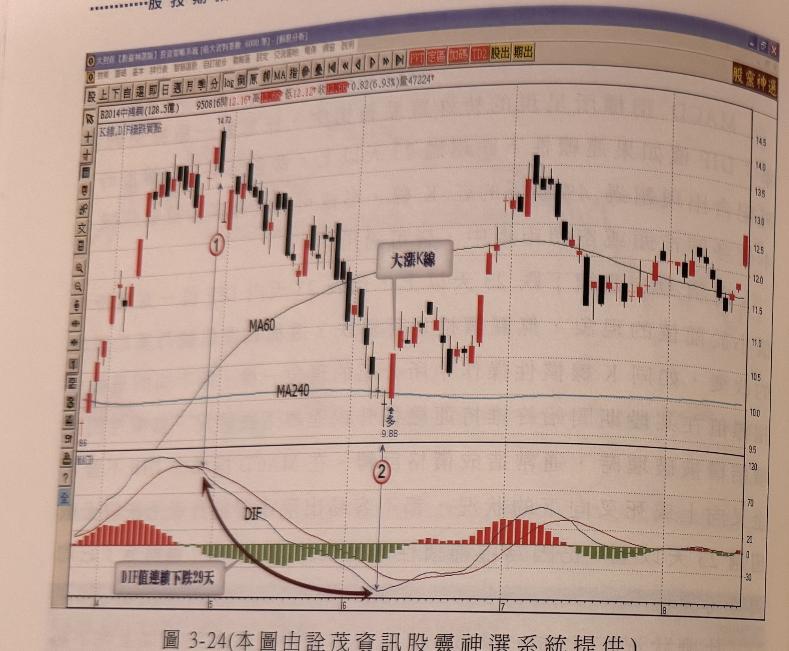

- **圖3-25**（p.157，中鴻鋼2014）：96年11月中旬季線與年線剛呈黃金交叉，DIF連續下跌26天（標示1至標示2），標示2隔日出現漲停K線，扭轉DIF下跌慣性；大漲K線同時突破前5天盤整區間最高點。示範買訊出現在季線年線黃金交叉初期，宜採波段（長線）操作的情境。

  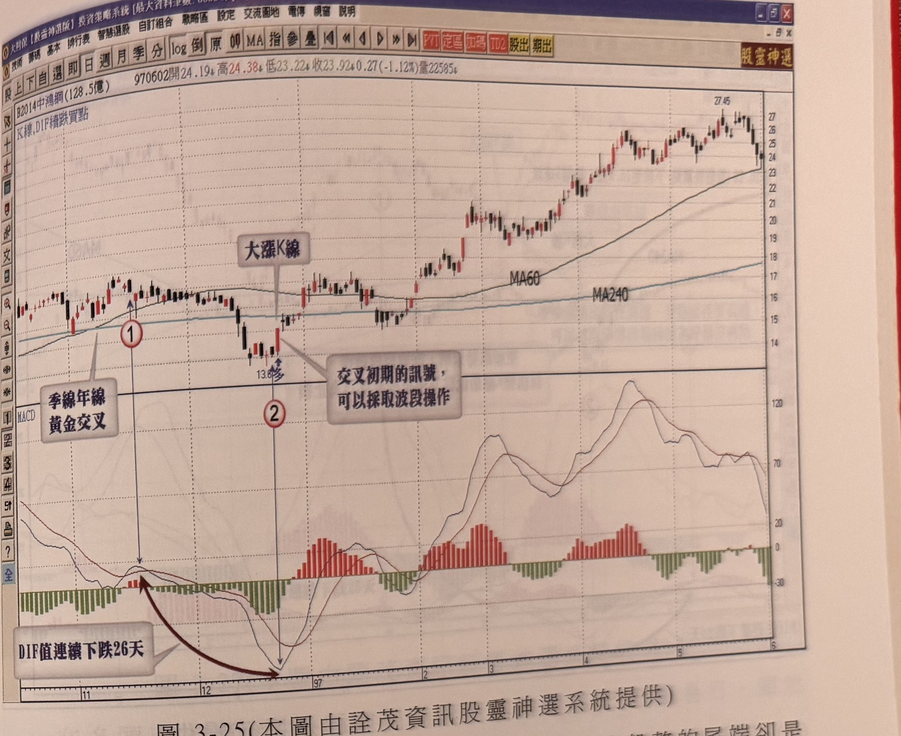

- **圖3-26**（p.158，首利1471）：空頭發展末端，自26.5元前波高點下跌至11.9元（跌幅逾5成），DIF連續下跌24天，隔日出現跳空大漲K線結束空頭走勢，先緩步推升，橫向整理等待季線年線收斂，其後突破年線大幅飆漲。

  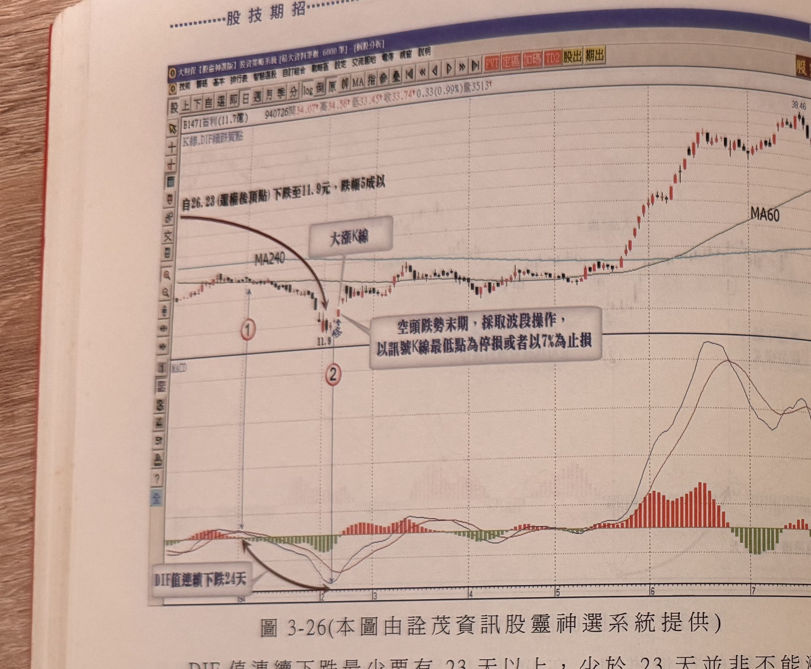

- **圖3-27**（p.159，鴻友2360）：96年4月見頂後逐波下跌，反彈皆不足以令DIF上勾，一路盤跌破季線，DIF連續下跌26天，直到5月上旬出現大漲K線改變下跌慣性，買點位置比傳統MACD黃金交叉提前許多，可搭配7%停損或階梯模式作為停損停利策略。

  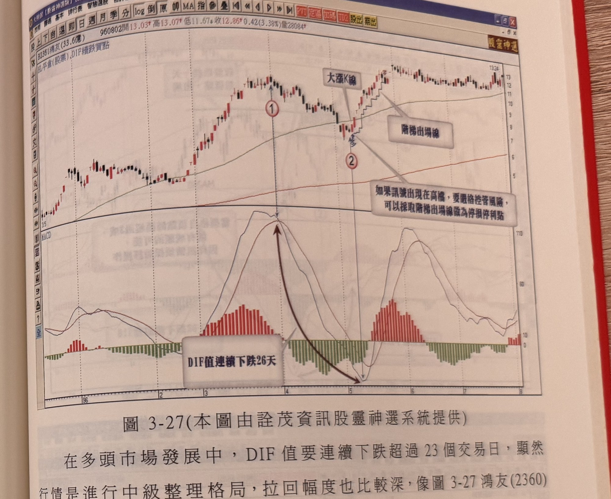

- **圖3-28**（p.160，巨庭1539）：DIF連續下跌23天後止跌上揚出現大漲K線買進訊號；圖說並提醒「當價格自頂點回檔超過3成，就有成頭的可能，因此訊號須採短打操作」，其後高檔區出現③④兩次相近高點後，收盤跌破前一天最低點即出場。示範第7節過濾規則2與第6節具體出場觸發規則。

  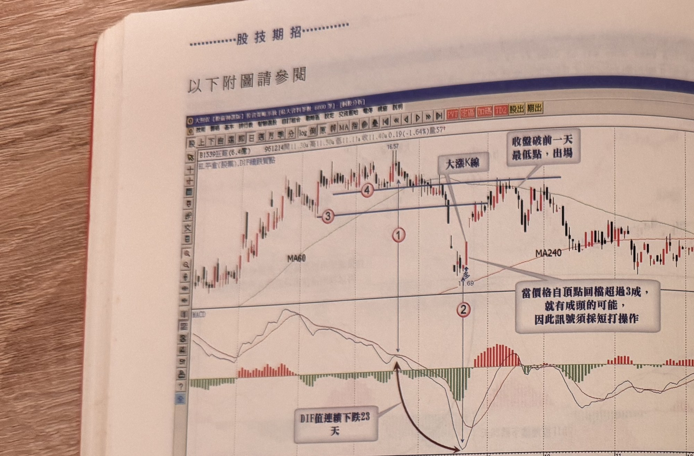

- **圖3-29 / 圖3-33**（p.160、p.162，友旺2444；原書重複印製同一畫面，股票代號、報價、走勢完全相同，兩處圖號不同僅為印刷重複）：DIF連續下跌28天後止跌上揚出現大漲K線買進訊號，其後股價反彈走高。

  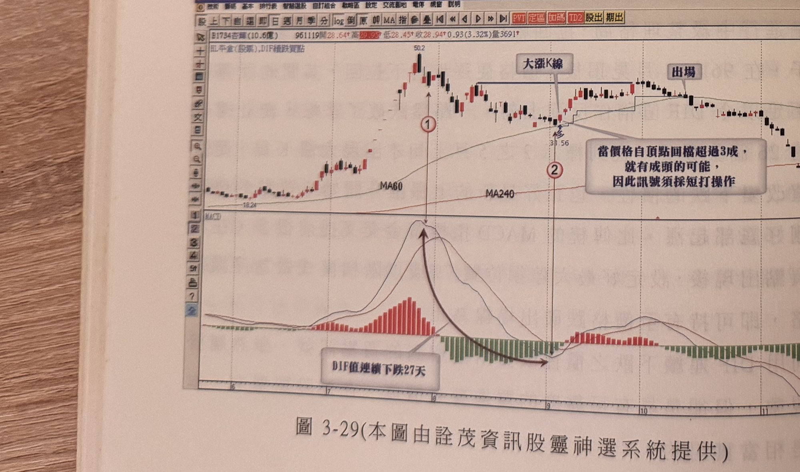
  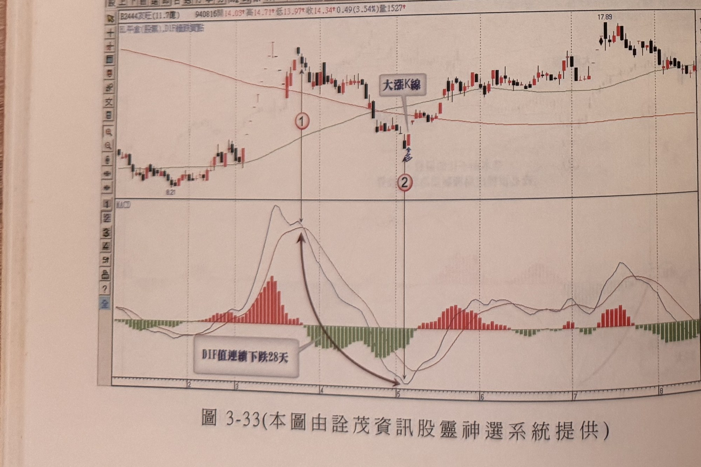

- **圖3-30**（p.161，個股股票代號原文不清[?]，疑似「蒙泰」）：自74.8元高點一路下跌至約34元附近，DIF連續下跌36天後止跌上揚，出現大漲K線買進訊號，其後股價反彈震盪走高。

  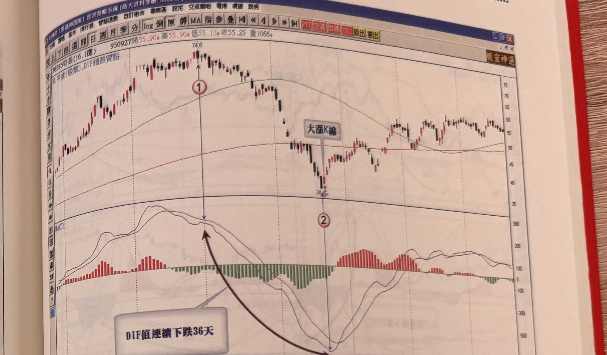

- **圖3-31**（p.161，云辰2390）：DIF連續下跌23天後止跌上揚出現大漲K線買進訊號，其後股價以階梯出場線上升，跌破階梯出場線處即出場；圖說提醒基本面不佳的個股務必依出場機制做好風險控管，本例後續股價確實反轉持續破底下跌。示範第6節「階梯出場線」出場機制與第7節過濾規則3。

  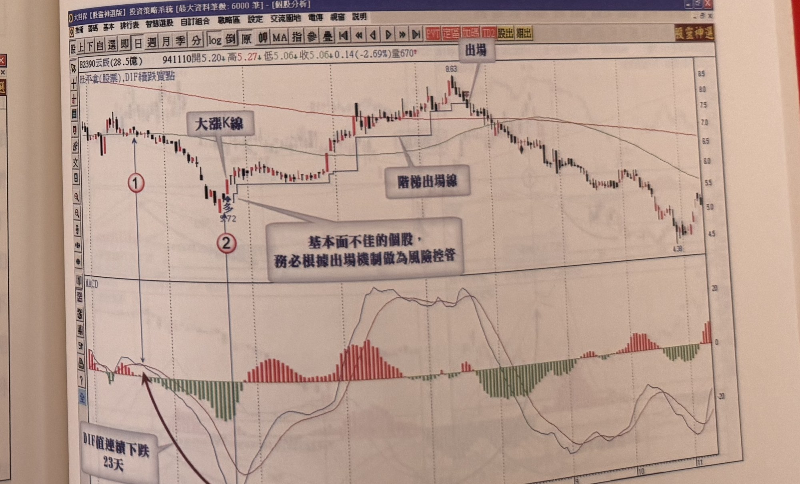

- **圖3-32**（p.162，友旺2444）：DIF連續下跌25天後止跌上揚出現大漲K線買進訊號，其後股價持續上漲。

  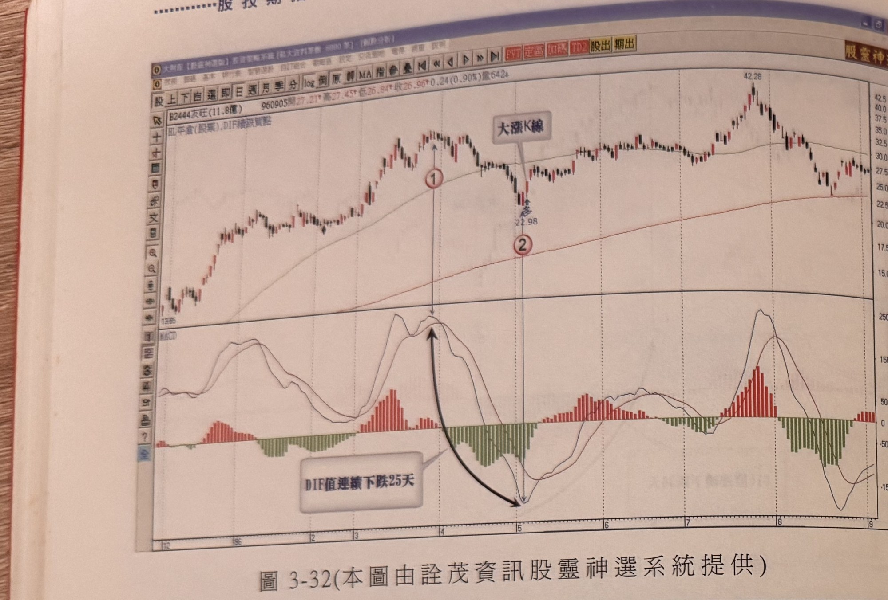

- **圖3-34 / 圖3-35**（p.163，旭富4119／環天科3499／東台4526／韋鐸5481四股組合圖；原書重複印製同一張組合圖，各自編號為圖3-34、圖3-35，內容完全相同）：四檔不同個股分別示範DIF連續下跌25天、24天、30天、26天後止跌翻紅、股價隨後反彈的相同型態，說明本方法在不同商品皆可觀察到類似天數範圍的訊號。

  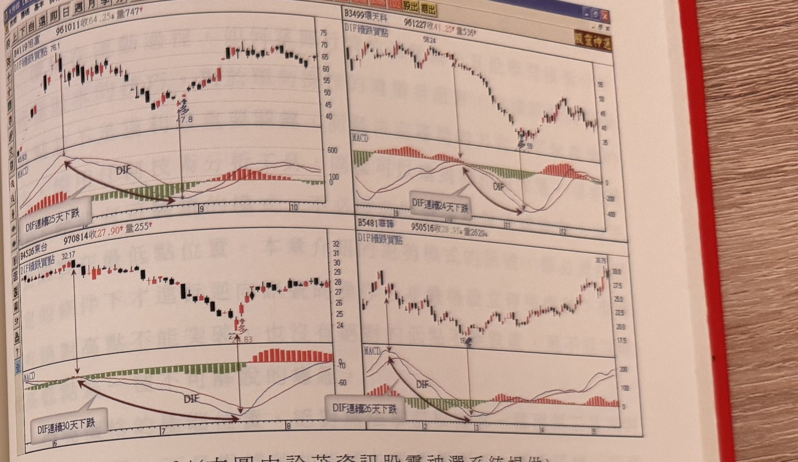
  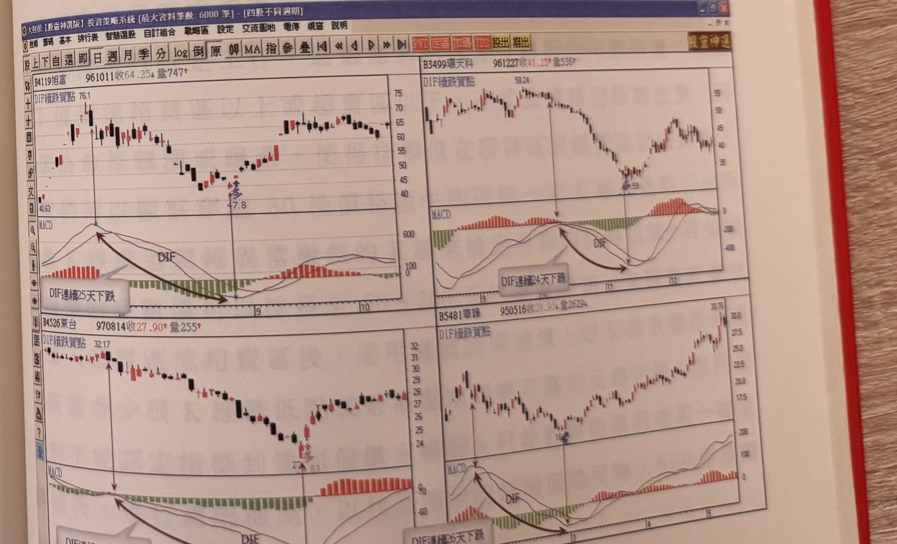

## 9. 作者提醒與常見錯誤
- DIF連續下跌23天以上是經驗法則，作者強調其為歷史資料驗證後最能表現慣性改變反轉效果的天數，非萬用鐵律（p.161）。
- 買訊出現的價格位階不同，應搭配不同的持有策略（長線波段 vs. 短打），詳見第2節四種情境（p.155）。
- 訊號出現在自頂點大幅回檔（超過3成）之後，宜提高警覺，可能已在構築頭部，須採短打而非長抱（p.160）。
- 基本面不佳的個股，即使出現本訊號，也務必嚴格依出場機制執行風控，避免長抱套牢（p.161）。

## 10. 規則速查（Checklist）
- [ ] DIF值連續下跌（今值皆小於前值）已達23個交易日以上
- [ ] DIF出現止跌上勾轉折
- [ ] 轉折當根K線為紅K線，且漲幅超過4%
- [ ] 已依訊號出現的價格位階（季年線金叉初期／高檔區／頂點反轉4成內／跌勢末期）決定長短線策略
- [ ] 已設定最大7%停損
- [ ] 已決定出場方式（階梯出場線／反轉K線組合／收盤破前一日低點）

## 11. 機器可讀規則
```yaml
signal: DIF連續下跌慣性改變買點
side: long
timeframe: daily
conditions:
  - id: C1
    desc: DIF值連續下跌（今值皆小於前值）達23個交易日以上，與價格當天漲跌無關
    source: p.155
  - id: C2
    desc: DIF出現止跌上勾轉折
    source: p.155-156
  - id: C3
    desc: 轉折當根K線為紅K線，且漲幅超過4%
    source: p.155
entry:
  price: DIF連續下跌23天以上後首度止跌上勾、漲幅逾4%的紅K線（訊號當根即為進場K線）
  timing: 訊號當根確認即進場
  source: p.155-156
stop_loss:
  points_pct: 7%
  ref: 進場價（訊號K線）
  reverse_on_stop: 書中未規定
  source: p.156-159
exit:
  options:
    - 階梯出場線
    - 觀察K線是否出現反轉K線組合
    - "特定範例：收盤價跌破前一天最低點即出場"
  holding_period_by_position:
    - "季線年線黃金交叉初期 → 長線持有（波段利潤）"
    - "高檔區（自低點漲逾一倍，或權值股漲逾7成）→ 短打"
    - "空頭市場，自頂點反轉4成以內 → 短打，階梯出場線停利"
    - "跌勢末期（自頂點反轉逾6成，虧損公司自頂點下跌8-9成）→ 未觸及7%停損則長線持有"
  source: p.155-160
filters:
  - id: F1
    desc: DIF連續下跌天數須達23天以上；未達23天不必然無效，但23天為驗證最佳天數
    source: p.161
  - id: F2
    desc: 若價格自頂點大幅回檔超過3成才出現訊號，可能已構築頭部，須短打不宜長抱
    source: p.160
  - id: F3
    desc: 基本面不佳個股務必嚴格依出場機制風控
    source: p.161
```

## 12. 待確認事項
- 圖3-30個股股票代號原文標示為「[?]」，OCR/照片不清，疑似「蒙泰」，不影響本方法規則判讀，僅代號存疑。
- 第6節出場方式中，「階梯出場線」「反轉K線組合」「收盤破前一天最低點」為原文中分散於不同範例提及的三種出場依據，原文未說明三者間的優先順序或適用條件差異，使用時需自行依情境選擇。

## 13. 原文出處
- `extracted/pages/IMG_8659.md`（p.154-155，本方法用p.155）
- `extracted/pages/IMG_8660.md`（p.156-157）
- `extracted/pages/IMG_8661.md`（p.158-159）
- `extracted/pages/IMG_8662.md`（p.160-161）
- `extracted/pages/IMG_8663.md`（p.162-163）
