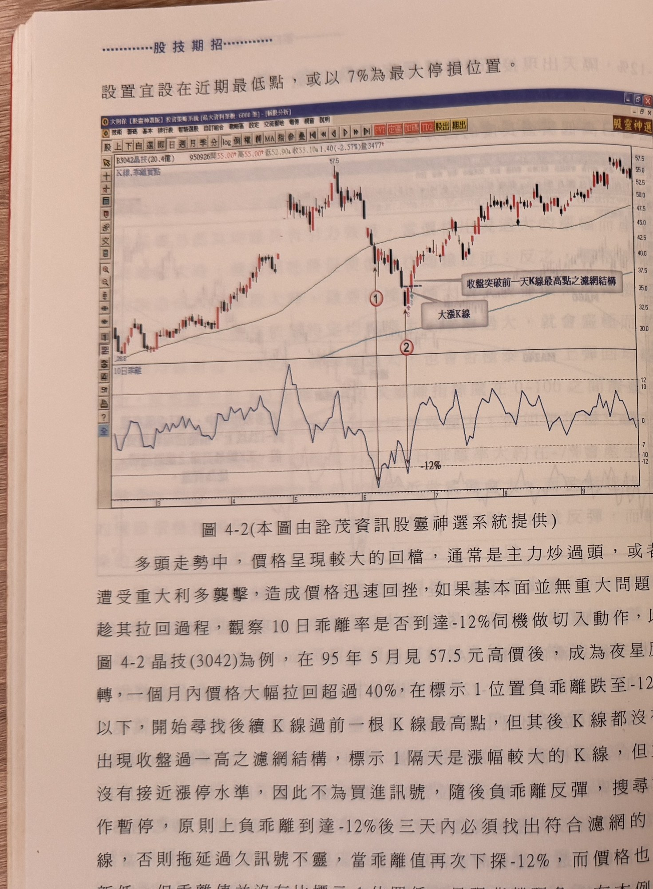
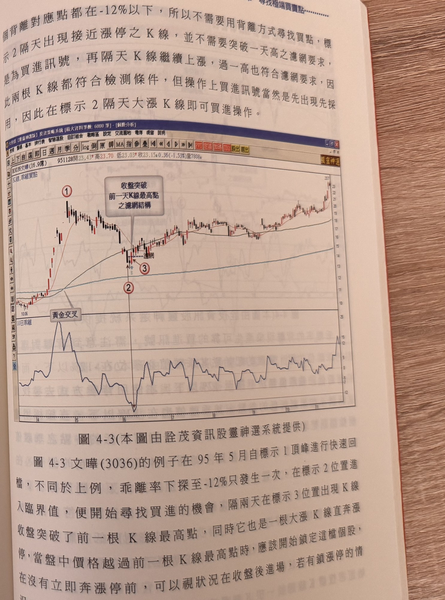
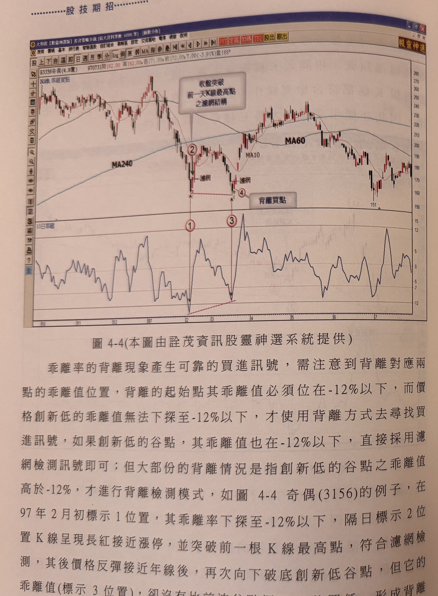
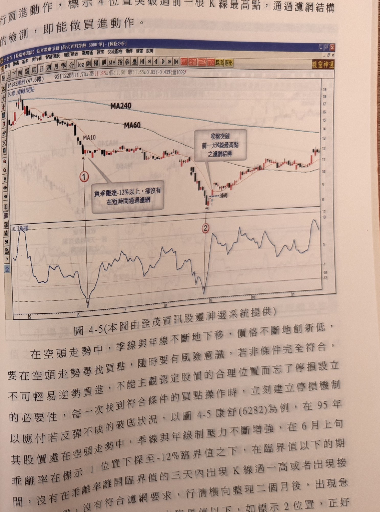
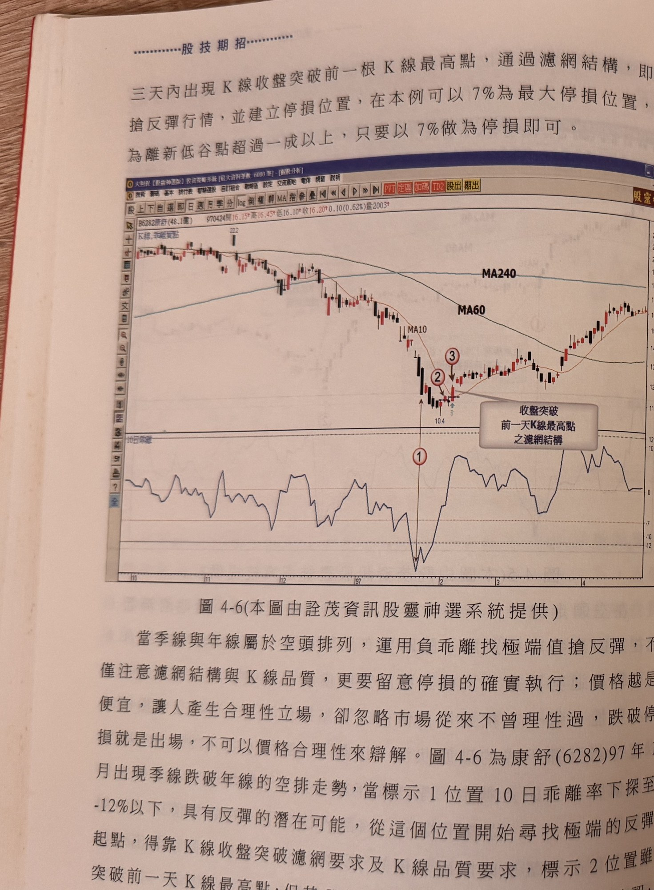
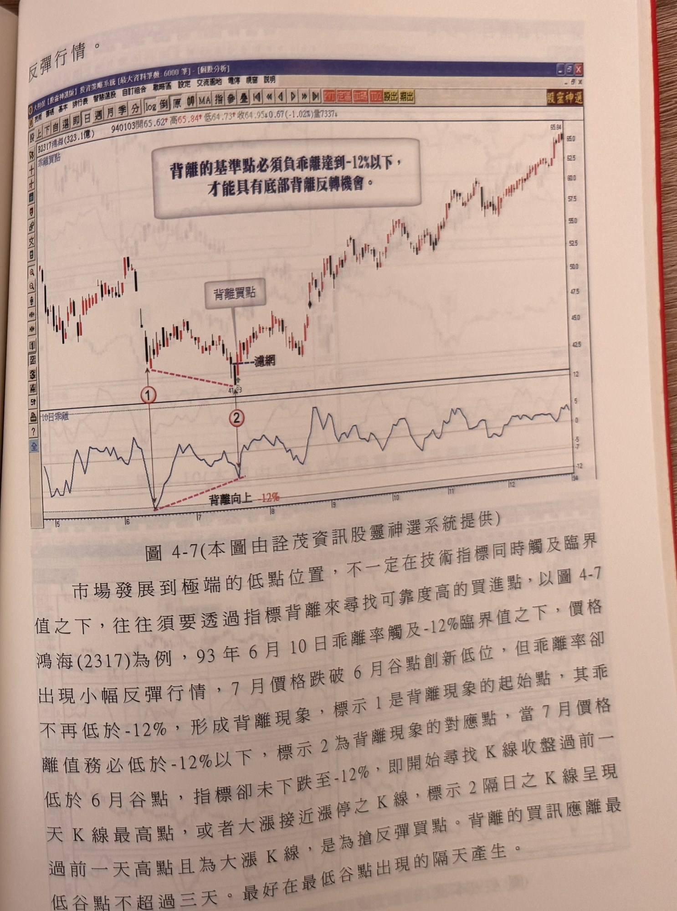
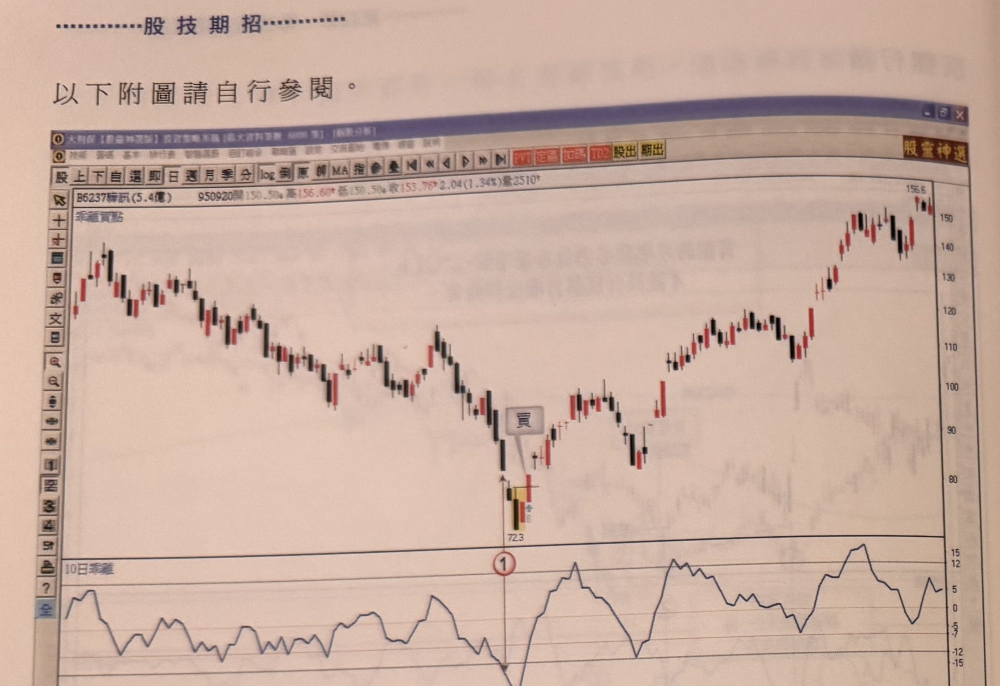
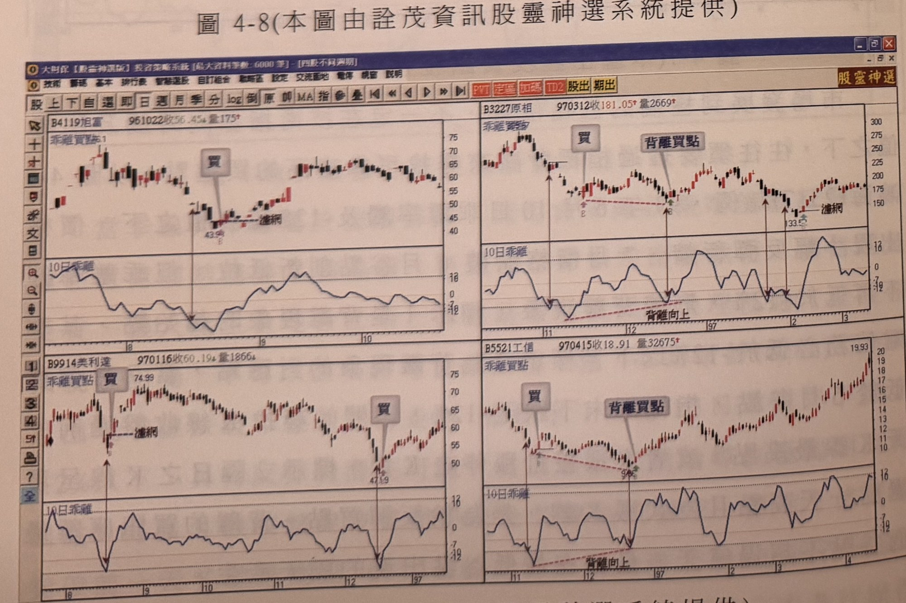
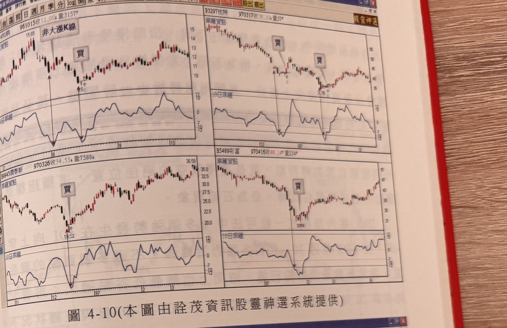
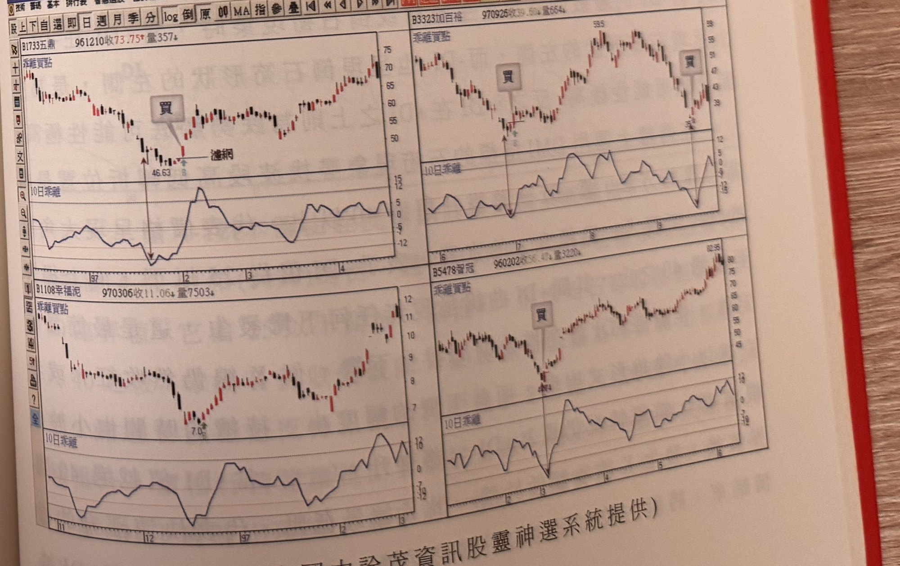

# 乖離率買點分布（負乖離搶反彈買進法）

> 一句話摘要：10日乖離率下探至-12%（績優股多頭中可用-7%）臨界值後，在3天內尋找K線收盤突破前一天最高點、或隔天出現接近漲停之K線作為買進濾網訊號，並以7%或近期低點為停損；若價格再創新低但乖離值未再低於前次低點，則構成背離，同樣以上述濾網尋找買點。

## 1. 核心概念

乖離率表達價格收盤與均線之間的漲跌幅度，立論基礎是均線具有「引力效果」：正乖離過大，獲利回吐會使價格拉近均線；負乖離過大，融券回補意願大增，也會使價格反彈向均線靠近（p.166）。乖離率不像 KD、RSI、威廉指標般固定在 0～100 之間震盪，不同個股波動差異極大：績優股回檔約 -7% 即容易止跌，較大回檔約 -12% 做底機會大；波動大的個股一般約 -12% 附近止跌，較深回檔可能達 -20% 以上仍不止跌（p.166）。

股價上漲過程，10日乖離率到達 +12% 常見獲利回吐跡象，但作者僅以此作為歷史概況說明，本節並未針對正乖離高檔訂出具體的放空進場／停損／停利規則，因此本文件只整理**負乖離搶反彈買進**的操作規則（p.166）。

乖離率到達臨界值本身不是買點，必須透過「濾網」二次檢定：K線是否收盤突破前一天最高點，或K線品質是否為接近漲停的強勢K線，唯有通過濾網才視為可靠的買進訊號（p.166）。

## 2. 適用前提

- 商品：書中範例皆為個股日線（含權值股與中小型股）。
- 需先計算 10 日乖離率：（收盤價－10日均線）／10日均線 × 100%。
- 績優股（穩定獲利型）在多頭市場拉回，臨界值可放寬至 -7%；波動較大個股臨界值採 -12%（p.166）。

## 3. 訊號定義

### 3.1 濾網型買進訊號（未背離）

1. C1：訊號K線前 3 天內，10日乖離率曾到達 ≤ -12%（一般股票）或 ≤ -7%（績優股，多頭市場）（p.166）。
2. C2a（路徑一）：其後某根K線**收盤突破前一天K線最高點**，即為買進訊號（p.166）。
3. C2b（路徑二）：C1 隔天直接出現一根**接近漲停之K線**，不須突破前一天最高點，即為買進訊號（p.167）。
4. K線品質要求（適用 C2a／C2b）：上影線不宜超過實體長度；K線收盤最好落在當日高低震盪長度的四分之三以上（p.167）。
5. 訊號K線漲幅最好能超過 3% 以上（p.167，圖4-1說明）。

### 3.2 背離型買進訊號

1. D1：價格第一次出現波段低點，其對應之 10日乖離率 ≤ -12%（背離基準點）（p.170、173）。
2. D2：價格其後再破底創新低，但對應之乖離率**沒有比 D1 低**（即高於 -12%），形成乖離率與價格的背離（p.170、173）。
3. D3：確認背離後（價格跌破 D1 低點之後），開始尋找符合 3.1 節 C2a／C2b 之濾網K線，作為買進訊號（p.170–171）。
4. D4：背離型買進訊號最好在最低谷點出現後**隔天**產生，最晚不宜超過 3 天（p.173）。
5. 例外：若第二個波段低點的乖離值也在 -12% 以下（即兩個低點都達到臨界值），則**不需要**採用背離方式尋找買點，直接以 3.1 節濾網檢測即可（p.169，圖4-2例）。

## 4. 進場

- 通過濾網（C2a／C2b）之K線收盤時，即可視為進場依據；若當日行情尚未立即衝上漲停，可視狀況於收盤後進場；若K線已鎖漲停，則可伺機追進（p.169，圖4-3）。
- 盤中價格一旦突破前一根K線最高點（濾網雛形出現），即應開始鎖定觀察該檔個股（p.169）。
- 濾網要求「3天內」找到符合條件的K線：乖離率到達 -12% 臨界值後，若 3 天內未出現符合濾網之K線，則暫停搜尋，訊號視為不成立（過期）（p.168）。
- 若後續乖離率再次探至 -12%（重新計時），則重新自 D1／C1 起算，尋找濾網K線（p.168、171–172）。

## 5. 停損

- 停損設在**近期最低點**，或以 **7% 為最大停損位置**（原文：「而以 7% 為最大停損位置，因為離新低谷點超過一成以上，只要以 7% 做為停損即可」）（p.168、172）。
- 書中未提供固定點數停損之替代方案；本節僅提供上述兩種停損擇一方式（近期低點 或 7%）。
- 書中未明確說明停損觸發後是否反手操作（本節未提及反手規則）。

## 6. 出場 / 停利

書中未明確說明。本節僅描述進場濾網與停損規則，未提供停利目標、移動停利或明確出場訊號的定義。

## 7. 過濾：不做的情況

1. 乖離率到達 -12%（或 -7%）臨界值後，若 3 天內未出現符合濾網之K線，訊號視為過期失效，不再搜尋（p.168：「負乖離到達-12%後三天內必須找出符合濾網的K線，否則拖延過久訊號不靈」）。
2. 若兩個波段低點的乖離值都已達 -12% 以下，不需採用背離方式尋找買點，直接用濾網檢測即可（p.169）。
3. 背離型買進訊號應在最低谷點隔天出現，超過 3 天則不採用（p.173）。
4. K線品質不佳者（上影線超過實體長度，或收盤未落在當日震幅上四分之三區間）不宜作為濾網確認K線（p.167，推論延伸自濾網K線品質要求）。

## 8. 範例解析

- **圖4-1**（p.167，中工2515）：12月中旬乖離率進入-12%臨界值之下，隔天K線上漲但收盤未突破前一根K線最高點，不符合濾網，非買訊；隔日續跌，乖離仍在臨界值下，該K線收盤突破前一根K線最高點，且上影線未超過實體，符合濾網，為買進訊號。

  

- **圖4-2**（p.168–169，晶技3042）：95年5月見57.5元高點後夜星反轉，一個月內大跌逾40%；標示1位置乖離跌破-12%，其後K線未出現收盤過前高，也非接近漲停K線，不符合濾網（3天內未達成，暫停搜尋）；乖離再次下探（標示2），與標示1兩者皆在-12%以下（不需背離判斷），標示2隔天出現接近漲停之K線，不需過前高，即為買進訊號。

  

- **圖4-3**（p.169–170，文曄3036）：乖離率僅一次下探-12%（標示2），開始尋找買點，隔兩天（標示3）出現K線收盤突破前一根最高點，同時直奔漲停，構成買進訊號；說明盤中價格越過前高即應開始鎖定個股觀察。

  

- **圖4-4**（p.170–171，奇偶3156）：標示1乖離 ≤ -12%，隔日標示2長紅接近漲停且突破前高，符合濾網，買進訊號成立；隨後反彈至年線後再破底創新低（標示3），但乖離值未比標示1低，形成背離；自價格跌破標示1低點起算背離，標示4位置K線收盤突破前一根最高點，通過濾網，構成背離型買進訊號。

  

- **圖4-5**（p.171–172，康舒6282）：空頭走勢中，標示1乖離下探-12%以下，但在其後3天內未出現符合濾網之K線，不符合條件；行情橫盤整理2個月後急殺，乖離再次跌破-12%（標示2），3天內出現K線收盤突破前一根最高點，通過濾網，可搶反彈買進，以7%為最大停損位置（因距新低谷點已逾一成）。

  

- **圖4-6**（p.172，康舒6282，另一年度）：97年1月季線跌破年線空排走勢，標示1乖離下探-12%以下；標示2雖突破前一天最高點，但K線品質非屬大漲K線，宜再確認；隔天標示3出現大漲接近漲停K線，條件皆符合，才進行搶反彈操作。

  

- **圖4-7**（p.173，鴻海2317）：93年6月10日乖離觸及-12%臨界值（標示1，背離起始點，乖離值必須 ≤-12%），價格小幅反彈；7月價格跌破6月谷點創新低，但乖離未再低於-12%（標示2，背離對應點），形成背離；標示2隔日出現大漲接近漲停K線，為搶反彈買點；背離買訊最好在最低谷點隔天出現，不超過3天。

  

- **圖4-8～4-11**（p.174–175）：書中註明「以下附圖請自行參閱」，未附段落解析文字，僅由圖說呈現多檔個股（騰訊6237；旭富4119、原相3227、美利達9914、工信5521；和潤、杭特3297、高泰新9945、彩富5489；五鼎1733、加百裕3323、幸福泥1108、智冠5478 等）的「買」與「背離買點」標示案例，各圖下方 10日乖離指標皆呈現觸及或接近 -12% 後反彈的走勢，屬同一規則之補充範例，細節條件未逐一說明。

  
  
  
  

## 9. 作者提醒與常見錯誤

- 指標到達超買區或超賣區不代表絕對的極端位置，必須透過濾網結構做二次檢定，才能找出可靠的反轉訊號（p.165）。
- 市場沒有絕對高點不能突破，也沒有絕對低點不能跌破，逆勢操作必須嚴格設立停損機制（p.165）。
- 背離判斷須留意基準點的乖離值必須低於 -12%，若兩個對應低點都低於 -12%，直接使用濾網即可，不必特意採用背離方式（p.170）。

## 10. 規則速查（Checklist）

- [ ] 訊號K線前3天內，10日乖離率曾 ≤ -12%（一般股）或 ≤ -7%（績優股多頭中）
- [ ] 濾網路徑一：其後K線收盤突破前一天最高點
- [ ] 濾網路徑二：臨界值隔天直接出現接近漲停之K線（不須過前高）
- [ ] K線品質：上影線不超過實體；收盤位在當日震幅上3/4以上為佳；漲幅宜>3%
- [ ] 若3天內未出現符合濾網之K線，訊號過期，暫停搜尋
- [ ] 背離：價格創新低但乖離值未再低於前次低點，跌破前低點後開始找濾網K線，隔天出現、最晚不超過3天
- [ ] 若兩個波段低點乖離值都≤-12%，不需用背離，直接用濾網
- [ ] 停損：近期最低點，或固定7%

## 11. 機器可讀規則

```yaml
signal: 乖離率買點（負乖離搶反彈）
side: long
timeframe: daily
conditions:
  - id: C1
    desc: 訊號K線前3天內10日乖離率曾達到 <= -12%（一般股）或 <= -7%（績優股多頭中）
    source: p.166
  - id: C2a
    desc: 其後K線收盤突破前一天K線最高點
    source: p.166
  - id: C2b
    desc: C1隔天直接出現接近漲停之K線，不需突破前一天最高點
    source: p.167
  - id: C_quality
    desc: 訊號K線上影線不超過實體長度，收盤落在當日高低震幅上3/4以上，漲幅宜>3%
    source: p.167
  - id: D1
    desc: 背離基準低點乖離值 <= -12%
    source: p.170, p.173
  - id: D2
    desc: 價格創新低但對應乖離值未再低於D1（背離）
    source: p.170, p.173
  - id: D3
    desc: 背離確認後（跌破D1低點）尋找C2a/C2b濾網K線
    source: p.170-171
entry:
  trigger: 通過濾網（C2a或C2b）之K線收盤
  timing_note: 未鎖漲停可收盤後進場；鎖漲停可伺機追進
  source: p.166-167, p.169
stop_loss:
  options:
    - 近期最低點
    - 固定7%
  source: p.168, p.172
exit: 書中未明確說明
filters:
  - desc: 乖離達臨界值後3天內未出現符合濾網之K線，訊號過期作廢
    source: p.168
  - desc: 兩個波段低點乖離值皆<=-12%時不需用背離，直接用濾網
    source: p.169
  - desc: 背離型買訊最好隔天出現，最晚不超過3天
    source: p.173
```

## 12. 待確認事項

- 本節僅描述負乖離的買進規則；高檔正乖離（+12%）獲利回吐僅為背景敘述，書中未給出對應的放空進場／停損／停利規則，因此未列入本文件之訊號定義。
- 圖4-8～4-11（p.174–175）僅有圖說標示「買」「背離買點」，無段落文字逐一解析各案例判斷依據，故範例解析僅摘要圖說內容，未逐條對應規則編號。

## 13. 原文出處

- `extracted/pages/IMG_8665.md`（p.166–167）
- `extracted/pages/IMG_8666.md`（p.168–169）
- `extracted/pages/IMG_8667.md`（p.170–171）
- `extracted/pages/IMG_8668.md`（p.172–173）
- `extracted/pages/IMG_8669.md`（p.174–175）
