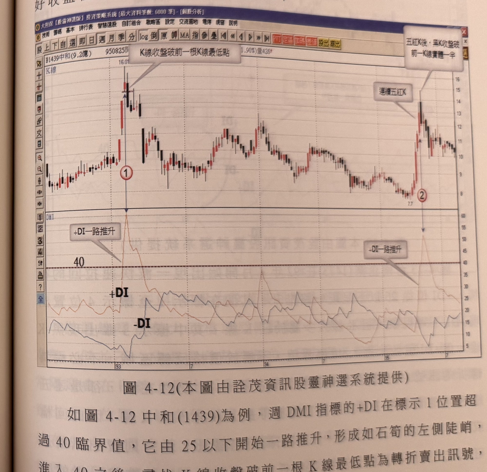
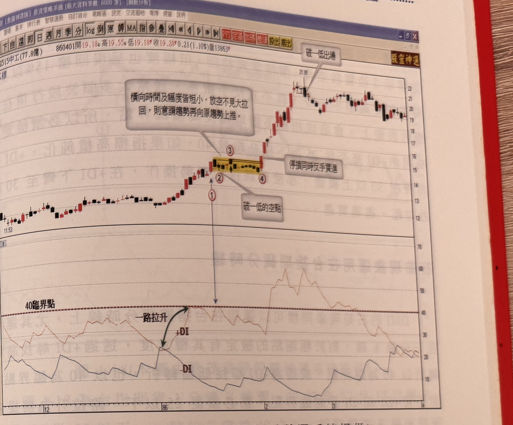
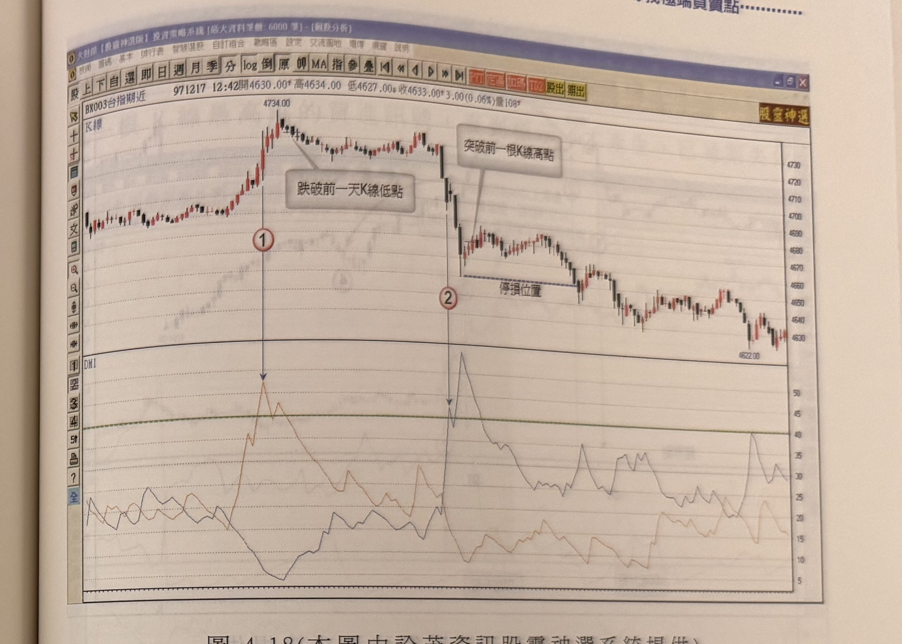

# 尋峰谷模式——DMI 石筍現象

> 一句話摘要：當 +DI（或-DI）從25以下一路陡峭推升穿越臨界點（週線／日線40，-DI週線35，台指期分時40）後，若K線收盤跌破（或突破）前一根K線最低（高）點，即構成賣出（買進）極端點訊號；停損設於最近波峰谷上下一檔或固定7%，1分鐘台指期可用固定點數或RSI(5)出場。

## 1. 核心概念

石灰岩洞穴中水滴堆積形成鐘乳石與石筍；當價格加速上漲，DMI指標會呈現高角度向上推升、轉折小、時間短，走勢形似石筍。價格漲升速率過快代表容易失控，指標推升到極致位置的轉折點，就是選擇放空（或買進）的絕佳位置，此種指標造山運動所形成的價格反轉，稱為「石筍現象」（p.176）。

傳統 DMI 用法（+DI 向上穿越 -DI 且 ADX 越過30代表多頭轉強）發生位置通常距最低谷點已遠，時間也過久，且在 +DI／-DI 交纏時雜訊偏多、濾網困難。本方法改採 +DI 與 -DI 各自產生「石筍」或「倒石筍」發散現象來尋找極端點：+DI 在 -DI 之上呈現石筍形狀左側、且 -DI 也呈現倒石筍形狀左側，為多頭見頂機率極高；反之 -DI 在 +DI 之上則為跌勢觸底機率極高（p.176）。由於未來走勢無法預知，操作當下只能看到「石筍形狀的左側」，這是本方法的本質限制（p.180）。

本方法在震盪格局（均線結構排列不一致）中可行性較高；若均線排列一致朝上或朝下發展（趨勢明確），指標容易在高檔／低檔鈍化，此時宜採順勢操作，而非逆勢找極端點（p.187–188）。

## 2. 適用前提

- 「一路推升」的定義：+DI（或-DI）從 25 以下開始向上揚升，直至越過臨界點，其間曲線**沒有任何下彎**發生（最嚴格定義）；若推升期間發生下彎但K線仍收紅（或為下彎幅度小、持續小於3根K線的小陰線），仍視為「一路推升」（p.176、186）。
- 臨界點因時間週期與方向不同：
  - 週線／日線 +DI（見頂放空）：40（p.176）。
  - 週線／日線 -DI（見底買進）：35（較低水準）（p.180）。
  - 台指期1分鐘（或5分鐘等）分時圖：+DI 與 -DI 皆以 **40** 為臨界點（p.184）。
- 起升點必須從 25 以下發動，以避免一路上漲（或下跌）的趨勢行情中指標長期高檔鈍化（+DI 在 30～50 間來回擺盪、未曾自25以下重新推升）時被誤用（p.184、186）。若指標高檔鈍化（未從25以下拉升），應改採順勢操作，在+DI下彎至約30附近勾起時進場買進（p.184）。
- 均線結構排列一致（趨勢明確）時，指標易鈍化，不利本方法；均線結構不一致（盤整格局）時，本方法可行性較高，尤其分時K線圖優勢明顯（p.187）。
- 日線結構較易出現價格突穿轉折前高低點的情形，週線相對少見；日線操作應同時留意成交量退潮或爆量以確認頭部反轉，並保持反手順勢的操作彈性（p.182）。

## 3. 訊號定義

### 3.1 放空訊號（+DI 石筍，週線／日線／台指期分時皆適用，僅臨界點不同）

1. C1：+DI 從 25 以下一路推升，穿越臨界點（週/日線40；台指期分時40）（p.176、184）。
2. C2：其後 K線**收盤跌破前一根K線最低點**，即為放空（賣出）訊號（p.176、184）。
3. 例外情形（五根紅K例外）：若 +DI 越過臨界點前的價格推升已連續出現 **5 根紅K線**，則當 +DI 下彎、K線收黑（但收盤未跌破前一根K線最低點）時，仍視為極端點成立，但此黑K線收盤須落在**前一根紅K線實體一半之下**（p.176–177）。此例外規則同樣適用於台指期分時圖（p.191：「連續五紅K線後，首根黑K可空，不受破一低限制」）。
4. 附加確認：若 5 根紅K後的首根黑K同時為**爆量K線**，賣出訊號可直接成立，不受「收盤須低於前一根紅K實體一半」之限制；若非爆量，須等到後續K線收盤跌破前一根K線最低點才能確認賣出訊號（p.178）。
5. 「連五黑後首根反色K」的反向確認：連續五根同色K線後首度出現的反色K線，本身必須是真正上漲（買進情境）或下跌（放空情境）的K線，若只是技術上換色但未真實反向變動，不能視為訊號（p.191：「連五黑後，首根紅K線，但非上漲紅K線，仍不能視為買訊」）。

### 3.2 買進訊號（-DI 石筍，鏡像規則）

1. C1'：-DI 從 25 以下一路推升，穿越臨界點（週/日線35；台指期分時40）（p.180、184）。
2. C2'：其後 K線**收盤突破前一根K線最高點**，即為買進訊號（p.180、184）。
3. 五根黑K例外（鏡像）：連續5根黑K線推升後，-DI 下彎、K線收紅但未突破前一根K線最高點，可視為極端點，該紅K收盤須落在前一根黑K實體一半之上（p.176–177，推論：鏡像對應3.1第3點原文僅明述放空方向，買進方向為對稱推論）。

## 4. 進場

- 通過 C2／C2' 之K線收盤時進場（p.176、184）。
- 訊號時效（週線／日線）：訊號離最高峰（放空）或最低谷（買進）不宜超過 **3 天**，且距離不宜超出峰谷值的 **15%**，兩項雙重過濾可提高可靠度（p.181–182）。
- 訊號時效（台指期分時）：不同範例文字略有出入——p.185（圖4-18）稱「離最高波峰或最低谷點以不超過**四根K線**為佳，超過者宜放棄操作」；p.186（圖4-19）則稱「一般最好在**10根K線內**完成，而且距離最高點不超過**三根**為佳」。兩處根數標準不一致，詳見第12節待確認事項。
- 若臨界點附近＋DI／-DI 見頂拉回後在短時間內（例如不到20分鐘）重新從30附近集結再上揚並突破前波高（低）點，應考慮**反手**而非單純停損（p.185，台指期1分鐘範例）。

## 5. 停損

- 週線／日線：以**最靠近的波峰或波谷上方／下方一檔**為停損，或以**固定7%**為停損位置（p.182）。
- 台指期分時：以**最靠近的波峰波谷上下一檔**位置作為停損，或採**固定點數**停損（p.184）。
- 反手規則：進場後價格突穿設定的停損位置，代表趨勢比預期強烈，應先停損出場；若K線以長紅或長黑姿態衝過或跌破區間高低點，可考慮**反手順勢操作**，且反手時停損須設在突破K線的最低點（反多情境）或跌破K線的最高點（反空情境），以防最壞的突破逆轉再度發生（p.182）。反手作多時，只要成交量沒有暴增，值得嘗試（p.182）。
- 反手的附加過濾：若原放空（或買進）後價格拉回（或反彈）幅度已達 **15%以上**，之後價格再重新穿越原轉折高（低）點時，**不宜**再反手操作（p.184，圖4-17延伸說明）。
- 橫盤反手情境：若放空（或買進）後行情呈現橫向窄幅整理（時間短、拉回幅度小），暗示原趨勢可能延續；當長紅K線突破橫盤區間最高點（或長黑K突破區間最低點）時，除回補原部位外，應考慮反手順勢操作，停損設於突破K線最低點（或跌破K線最高點）（p.183–184，圖4-17）。

## 6. 出場 / 停利

- **台指期1分鐘超短線**：可採固定點數出場（書中示範 **20～30點**為目標），或以 **RSI(參數5)** 為出場機制——買進訊號後以RSI過70之後的下彎為出場位置；放空訊號後以RSI穿破30後上勾為出場位置（p.184）。
- **週線／日線**：書中未明確說明具體停利機制，僅描述「後續行情不斷推升，波段獲利自然可觀」之敘述性文字（p.182），以及前述第5節反手／停損管理規則。書中未提供固定停利目標或移動停利方法。

## 7. 過濾：不做的情況

1. +DI（或-DI）未從25以下重新拉升、而是在臨界點以上區間來回擺盪（高檔鈍化），代表行情呈一路上漲（下跌）趨勢，無法透過破一低（過一高）檢定極端點，不宜放空（買進）（p.186，圖4-20）。
2. 指標進入臨界點後，到訊號產生若拖延過久（詳見第4節時效說明，兩處標準不一致），訊號視為過期失效，不予採用（p.186，圖4-19：標示4「已過期失效」）。
3. 訊號距最高／最低點超過15%幅度者，即使天數符合，仍不宜視為高可靠度訊號（p.181–182，週線／日線適用）。
4. +DI 越過臨界點前的下彎，若 +DI 值尚未進入臨界點，不列為轉折訊號（縱使 K 線為黑K）（p.178，圖4-13標示3例）。
5. 反手：若原放空（買進）已產生拉回（反彈）15%以上，之後再穿越原轉折點，不宜反手（p.184）。
6. 橫盤反手僅在橫向整理**時間夠長**時才具爆發力；若整理時間不夠長，僅需停損出場，不需反手操作（p.202，圖4-35，雖列於第三節範例但規則對DMI反手情境同樣適用，屬本節「反手／停損管理」原則之延伸案例）。

## 8. 範例解析

- **圖4-12**（p.177，中和1439週線）：標示1位置週 +DI 超過40臨界值（由25以下一路推升），標示1隔週K線收盤破前一根K線最低點，構成放空訊號；標示2位置 +DI 同樣從25推升，連續拉出5根紅K線後，+DI下彎時出現黑K線且收盤低於前一根紅K實體一半，視為回檔或反轉賣出訊號。

  

- **圖4-13**（p.178，台南企業1473週線）：標示1至4位置+DI下彎但K線多為紅K（標示3雖黑K但+DI未達40），不視為轉折；標示6位置+DI仍在漲，卻是連5紅K後首根黑K（帶長上影小黑K），因未爆出週最大量，須等標示7位置K線收盤跌破前一根最低點才能確認賣出訊號。

  

- **圖4-14**（p.179，瑞軒2489週線）：96年5月突破25元後上漲加速，標示1位置+DI觸及40臨界值後隔週收黑但未侵入標示1紅K實體一半，未達轉折；3週窄幅盤整後再推升，標示2隔週+DI下彎但收盤仍未跌破標示2紅K實體一半；標示3位置黑K線收盤跌破前一根最低點，週線轉折確立，但隔週反彈仍可能發生，說明週線訊號僅用於偵測趨勢方向改變，實際放空時機可另參考日線 RSI 過80彎頭或 KD 死亡交叉（p.179–180，補充說明，非本節核心規則）。

  

- **圖4-15**（p.180，遠紡1402日線）：示意-DI石筍現象僅能觀察左側；96年2月底-DI從20以下快速竄升越過35臨界點，未來發展可能如標示1直線拉回形成石筍，或如標示2在臨界點附近震盪。

  

- **圖4-16**（p.181–182，遠紡1402接續走勢）：-DI越過臨界點35到達標示2，尋找到標示3的K線收盤突破前一天最高點，形成買進訊號，距底部最低點3天、幅度符合雙重過濾，以固定7%或跌破21.76元下方一檔為停損，後續行情持續推升。

  

- **圖4-17**（p.183–184，中工2515日線）：+DI一路推升至40臨界點後，標示2出現破一低放空訊號，但後續價格未拉回反呈橫向盤整（+DI大部分在30以上游走，箱形窄幅），標示4出現長紅K線突破橫盤區間最高點（標示3）時，回補放空並反手做多，停損設於標示4突破K線最低點，後續漲幅比前波更大；反例說明：若標示2放空後拉回幅度達15%以上，再穿越標示3時不宜反手做多。

  

- **圖4-18**（p.185，台指期1分鐘）：97年12月17日標示1位置+DI一路拉升穿越40，K線收盤破前一根最低點為空點，以4734上方一檔或固定點數為停損；若+DI短時間內（不到20分鐘）重新從30附近集結上揚並突破4734，應考慮反手做多；標示2位置-DI從25竄升穿越40臨界點，尋找突破前一根最高點之買進訊號，並以最靠近谷點下方一檔為停損，訊號離最高波峰或最低谷點不超過4根K線為佳。

  

- **圖4-19**（p.186–187，台指期1分鐘）：98年2月5日標示1位置+DI從25一路推升越過臨界點，標示2出現破一低放空訊號（恰為最高點次一根K線），符合濾網；標示3位置-DI竄升穿越40臨界點但遲遲未出現過一高買進訊號，直到標示4才產生，已過期失效（一般最好10根K線內完成，距最高點不超過3根為佳）。

  

- **圖4-20**（p.187，台指期1分鐘）：98年2月19日標示1位置+DI進入臨界點40以上但未快速折返40以下（鈍化），研判行情呈一路上漲，黃色區域尾端雖出現破一低但不宜放空；另一情境：+DI破臨界點後產生破一低放空訊號，但後續無大幅拉回僅橫向整理，+DI在30以上來回擺盪，當行情突破新高觸及放空停損位置時，除立刻出場外宜採反多動作。

  

- **圖4-21**（p.188，台指期5分鐘）：行情呈震盪格局，DMI石筍現象可準確偵察峰谷位置，標示1（-DI攀升，過一高買進，停損設於下方）、標示2（+DI攀升，破一低放空，停損設於上方）、標示3（過一高買進）依序出現，示範均線結構排列不一致（震盪格局）時本方法可行性高。

  

- **圖4-22**（p.188，佳必琪6197）：股價上漲至167.09高點，+DI攀升觸及約55（超過40臨界線）後回落，構成破一低賣出訊號。

  

- **圖4-23**（p.189，益通3452，「-DI買訊(原型)」）：股價自282.07高點下跌至低點，-DI攀升觸及約40臨界線，構成過一高買進訊號；反彈後再回落至135.85附近，-DI再度攀升觸及臨界線上方（約50），再次構成過一高買進訊號。

  

- **圖4-24**（p.190，正崴2392，「-DI買訊(原型)，-DI賣訊」）：標示「多」「空」交替於股價高低點，示範+DI/-DI反覆震盪交叉之案例，圖說未附段落文字解析各標示的具體判斷條件。

  

- **圖4-25**（p.190，台指期近K線）：標示1位置指標攀升觸及臨界線附近後回落，標示2位置K線收盤跌破前一根最低點，為空點。

  

- **圖4-26**（p.191，台指期近K線）：標示1破一低放空；其後連五黑後首根紅K但非上漲紅K線，不視為買訊；標示2為過一高買進之谷點（另有固定點數停損建議，可避開觸及停損）；過一高買進後續漲回落至標示3破一低放空；漲至標示4（連續五紅K線後首根黑K可空，不受破一低限制）；文字方塊提醒：放空後若行情無大幅拉回，表示原趨勢將續強，宜反多操作。

  

## 9. 作者提醒與常見錯誤

- 本方法必須看清「石筍」形狀左側即做判斷，但未來走勢無法預知，存在風險；操作重點在於用較小停損換取較大波段利潤，才值得逆勢摸底（或摸頂）（p.180–181）。
- 買賣訊號透過雙重過濾（時間、幅度）能提高可靠度；偏離最高（低）點過久或幅度過大才產生的訊號，可能埋藏陷阱，應選擇忽略訊號、放棄操作（p.182）。
- 日線較易發生價格突穿轉折前高低點，週線較少見；日線操作宜同時參考成交量變化，並保持反手順勢的彈性（p.182）。
- 大多頭波段中指標易不斷觸及高檔臨界點造成鈍化，須檢定石筍現象（是否從25以下拉升），若指標鈍化應改採順勢操作（p.184）。
- 均線排列一致（趨勢明確）時宜順勢操作，均線排列不一致（震盪格局）時本方法效果較佳（p.187）。

## 10. 規則速查（Checklist）

- [ ] +DI（或-DI）從25以下一路推升，無下彎或下彎幅度小於3根K線且K線仍收紅（黑）
- [ ] 穿越臨界點：週/日線 +DI=40、-DI=35；台指期分時 +DI/-DI 皆=40
- [ ] K線收盤跌破前一根最低點（放空）／突破前一根最高點（買進）
- [ ] 五根同色K例外：連5根同色K後首根反色K收盤在前一根實體一半之外（或爆量可豁免此限制）
- [ ] 訊號時效：週/日線不超過峰谷3天且幅度<15%；分時圖標準不一（4根 或 10根內完成、距峰谷≤3根）
- [ ] 停損：最近波峰谷上下一檔，或固定7%（週/日線）／固定點數（分時）
- [ ] 突破停損位置且為長紅/長黑衝過區間 → 考慮反手，停損設於突破K線極值處
- [ ] 反手前檢查：拉回/反彈幅度已達15%以上者不宜反手
- [ ] 台指期1分鐘出場：固定20~30點，或RSI(5)過70下彎（多單）／破30上勾（空單）

## 11. 機器可讀規則

```yaml
signal: DMI石筍現象
side: both
timeframe: [weekly, daily, 1m, 5m]
conditions:
  - id: C1_short
    desc: +DI從25以下一路推升穿越臨界點（週/日線40，台指期分時40），推升期間無下彎或下彎<3根K線且K線仍收紅
    source: p.176, p.184, p.186
  - id: C2_short
    desc: K線收盤跌破前一根K線最低點
    source: p.176, p.184
  - id: C1_long
    desc: -DI從25以下一路推升穿越臨界點（週/日線35，台指期分時40）
    source: p.180, p.184
  - id: C2_long
    desc: K線收盤突破前一根K線最高點
    source: p.180, p.184
  - id: exception_5bar
    desc: 連續5根同色K線推升後，首根反色K線收盤越過前一根同色K線實體一半，或該K線為爆量K線則不受此限制
    source: p.176-177, p.178, p.191
entry:
  trigger: C2_short或C2_long之K線收盤
  timing_weekly_daily: 距峰谷不超過3天，且幅度不超過峰谷值15%
  timing_intraday: 標準不一致，見filters（p.185: 不超過4根K線；p.186: 10根K線內完成且距峰谷不超過3根）
  source: p.176, p.181-182, p.185-186
stop_loss:
  options:
    - 最近波峰/波谷上方或下方一檔
    - 固定7%（週/日線）
    - 固定點數（台指期分時）
  reverse_on_breakout:
    desc: 停損位置被長紅/長黑突破時，考慮反手，反手停損設於突破K線最低點（反多）或最高點（反空）
    exclude_if: 拉回/反彈幅度已達15%以上
  source: p.182, p.184
exit:
  intraday_1m:
    desc: 固定點數出場（20~30點），或RSI(5)：多單於RSI過70後下彎出場，空單於RSI破30後上勾出場
    source: p.184
  weekly_daily: 書中未明確說明
filters:
  - desc: 指標未從25以下重新拉升、於臨界點以上鈍化擺盪，代表一路漲跌趨勢，不適用破一低/過一高濾網
    source: p.186
  - desc: 訊號拖延過久（分時圖標準：見timing_intraday）視為過期失效
    source: p.186
  - desc: 訊號距峰谷幅度超過15%，可靠度降低
    source: p.181-182
  - desc: 連5根同色K後首根反色K若非真實反向變動（僅技術換色）不視為訊號
    source: p.191
  - desc: 橫盤整理時間不夠長時，突破後僅停損出場不需反手
    source: p.202（見gq-04-03範例，規則同適用本節反手情境）
```

## 12. 待確認事項

- 台指期分時圖的「訊號時效」根數標準，書中兩處說法不一致：p.185（圖4-18）稱「離最高波峰或最低谷點以不超過四根K線為佳」；p.186（圖4-19）稱「一般最好在10根K線內完成，而且距離最高點不超過三根為佳」。兩者對「峰谷距離幾根K線內有效」給出不同數字（4 vs 3），文件中原樣併陳，未擅自取捨或統一。
- 3.2節「五根黑K例外」（買進方向鏡像規則）原文僅明述放空方向（p.176–177 連續5紅K），買進方向的鏡像規則為推論延伸，書中未逐字重複敘述；已標註「（推論）」。
- 圖4-24（p.190，正崴2392）僅有圖說標示多空點，無段落文字解析各標示點的具體判斷依據，範例解析僅摘要圖說內容。

## 13. 原文出處

- `extracted/pages/IMG_8671.md`（p.176–177）
- `extracted/pages/IMG_8672.md`（p.178–179）
- `extracted/pages/IMG_8673.md`（p.180–181）
- `extracted/pages/IMG_8674.md`（p.182–183）
- `extracted/pages/IMG_8675.md`（p.184–185）
- `extracted/pages/IMG_8676.md`（p.186–187）
- `extracted/pages/IMG_8677.md`（p.188–189）
- `extracted/pages/IMG_8678.md`（p.190–191）
