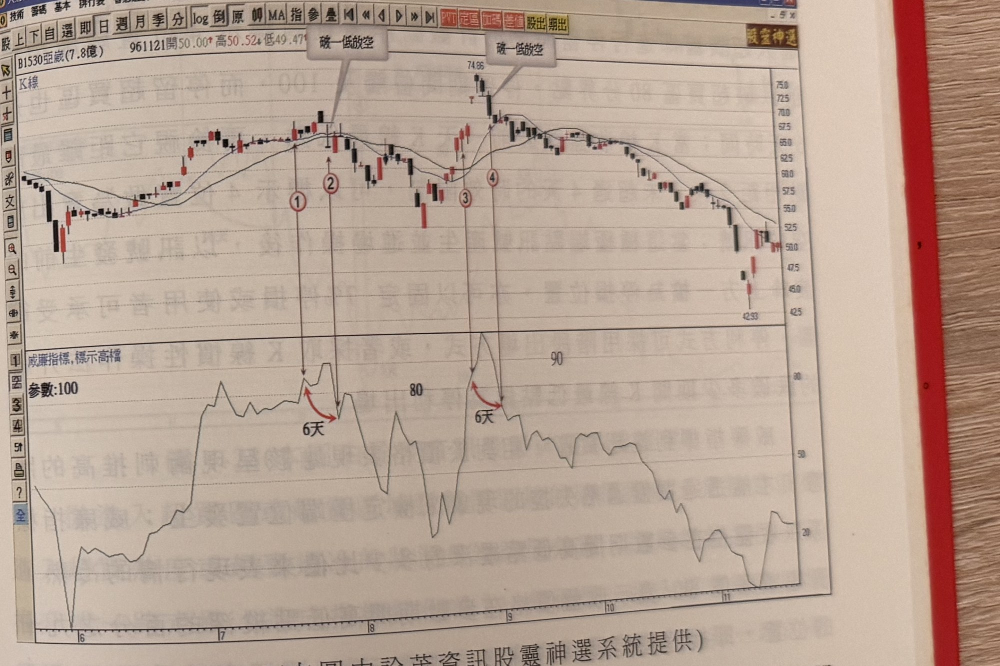
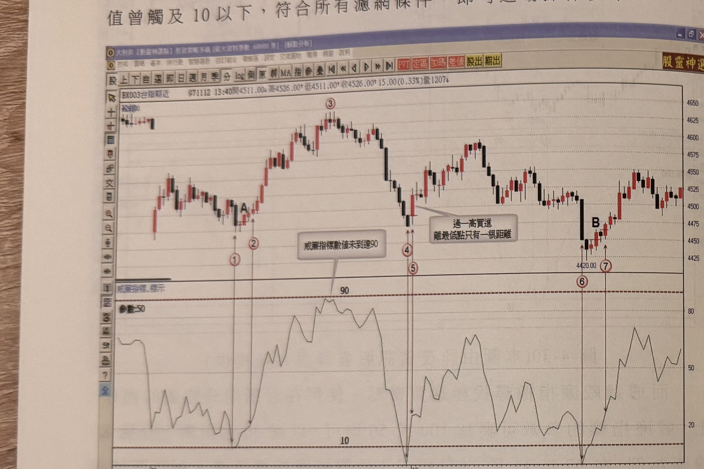
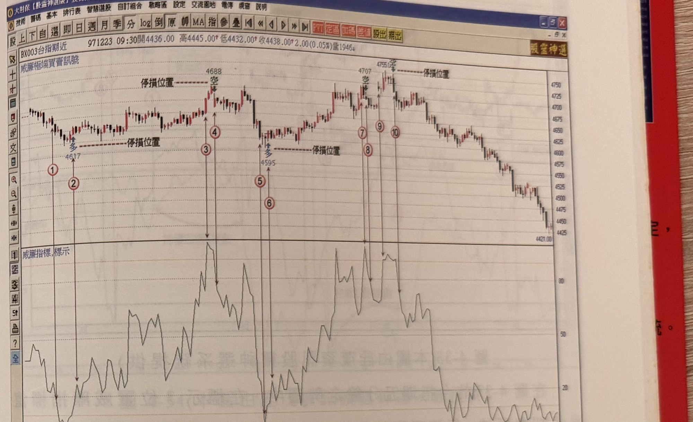
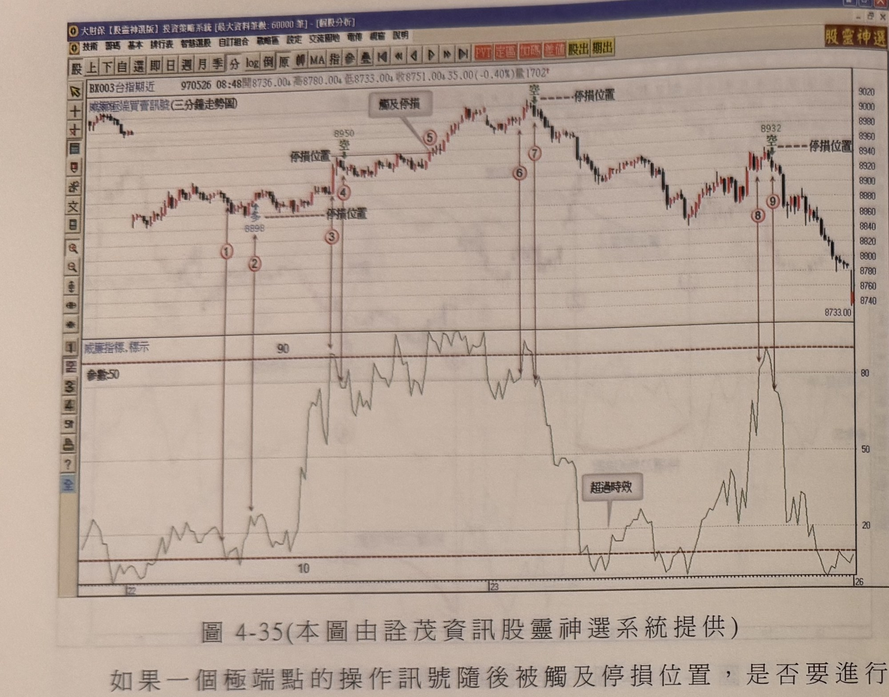
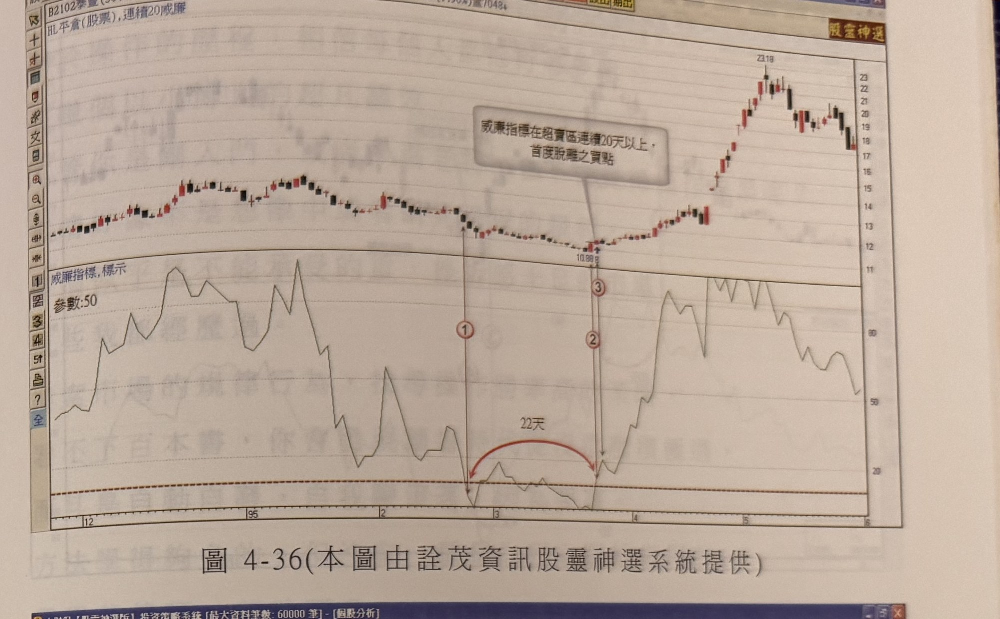
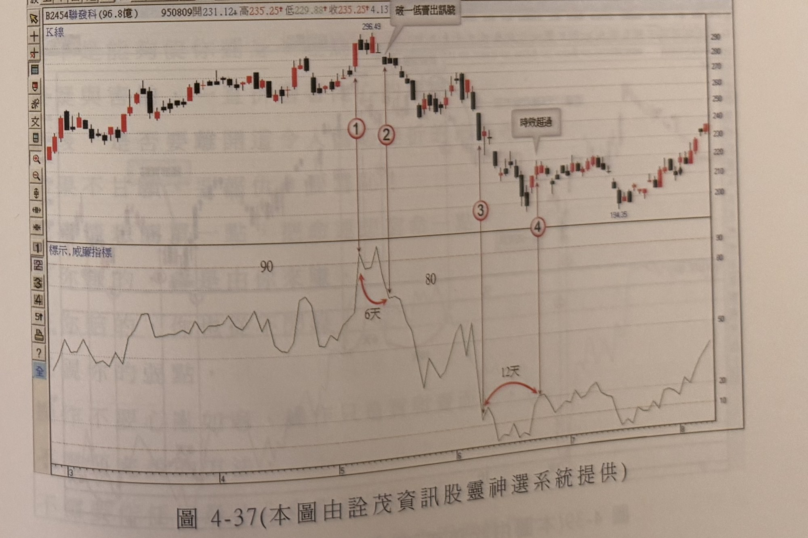

# 威廉指標找極端點

> 一句話摘要：將威廉指標觀察天期拉長至50～100天，記錄指標停留在超買（80以上，至少觸及90）或超賣（20以下，至少觸及10）區域的K線根數；首度離開區域時，若K線收盤跌破（突破）前一天K線的「真實低（高）點」，且距離最高峰（最低谷）不超過4天（根），即構成賣出（買進）訊號；停損設於波峰谷上下一檔或固定7%。

## 1. 核心概念

威廉指標雖敏感，但把觀察天期拉長至50天以上或100天以上，其高低檔檢定就有可靠度。作法是：當威廉指標值竄升至超買區域，開始計數其停留在超買（或超賣）區域的K線根數，直到指標離開該區域才停止計數；若進入到離開的根數在10根以內，則初步認定為極端位置形成機率極高（p.192）。

本節界定超買超賣區域的畫法，與RSI、KD一致，採「**80～100為超買區（畫在圖形上方）、0～20為超賣區（畫在圖形下方）**」的表示法，而非一般威廉指標慣用的「0～20超買（上方）、80～100超賣（下方）」畫法（p.193：「一般界定威廉指標超買區為0～20（在圖形上方），超賣區為80～100（在圖形下方），亦有方便與RSI指標KD指標比較以80～100為超買區（在圖形上方），以0～20為超賣區（在圖形下方），本節界定超買超賣區域採取後者。」）。閱讀本文件及原書圖表時，「進入超買區」一律指指標數值升至80以上（並至少觸及90），「進入超賣區」一律指指標數值跌至20以下（並至少觸及10）。

威廉值反映收盤價在參數期間高低點縱深的相對位置（例如威廉值90表示收盤價位在區間高低縱深的90%位置，即接近區間最高點僅10%距離），因此威廉值到達超買區，理論上應對應價格衝刺推高的狀態；若價格橫盤但參數區間最高點快速下移，也可能使威廉值假性進入超買區，此為假象，不可採用（p.194）。

## 2. 適用前提

- 威廉指標參數：股票日線可用50或100天期；台指期分時可用50或100根K線（p.192、196、198）。
- 進入超買區域，威廉指標**必須至少有一天（一根K線）觸及90以上**；進入超賣區域，**必須至少有一天觸及10以下**，否則不列入極端位置考量（p.192、193–194）。
- 若威廉值離開超買（超賣）區時，價格K線已距最高（最低）點超過4天以上，反轉訊號視為不明確（p.192）。
- 若進入到離開超買超賣區域的天數（根數）超過10天（日線），代表趨勢沿一路推升／下跌發展，非一時衝動的過熱／過冷，此時**不宜逆勢操作，宜順勢操作**（p.195）。
- 例外（僅限30分鐘以上K線圖）：若在超買超賣區域連續停留**超過20根K線以上**，期間未曾任何一次離開區域，則當它**首度**離開時，只要符合突破一高／跌破一低，且距最高峰或最低谷不超過4根K線，仍可作為操作訊號；但此做法**只適合運用在30分鐘K線以上之走勢圖**（p.200–201）。

## 3. 訊號定義

「真實低點」＝前一天K線最低點與前二天K線收盤價，取兩者較低者；「真實高點」＝前一天K線最高點與前二天K線收盤價，取兩者較高者（p.192）。

### 3.1 賣出訊號（超買區）

1. C1：威廉指標值進入超買區域（≥80），且期間曾**至少一天觸及90以上**（p.192、193–194）。
2. C2：威廉指標值**跌破超買區80**（即離開超買區）。
3. C3：離開時，價格K線距離最高峰點**不超過4天**（p.192）。
4. C4：K線收盤須**跌破前一天K線的真實低點**（p.192）。
5. 滿足 C1–C4 即視為賣出（放空）訊號。

### 3.2 買進訊號（超賣區，鏡像規則）

1. C1'：威廉指標值進入超賣區域（≤20），且期間曾**至少一天觸及10以下**（p.192）。
2. C2'：威廉指標值**離開超賣區20**（即向上突破20）。
3. C3'：離開時，價格K線距離最低谷點**不超過4天**（p.192）。
4. C4'：K線收盤須**突破前一天K線的真實高點**（p.192）。
5. 滿足 C1'–C4' 即視為買進訊號。

### 3.3 提前訊號（慣性破壞）

1. E1（提前賣訊）：威廉指標**尚未**離開超買區，但K線收盤已跌破前一天K線真實低點；須配合先前行情已保持某種上漲慣性（例如連續**8根以上**K線未曾跌破前一天真實低點，此次首度跌破，符合慣性破壞特性）才成立，否則不成立（p.192、198）。
2. E2（提前買訊，鏡像）：威廉指標**尚未**離開超賣區，但K線收盤已突破前一天K線真實高點；須配合先前連續**8根以上**K線未曾突破前一天真實高點的下跌慣性，此次首度突破，才成立提前買訊（p.192、196）。

### 3.4 長時間停留例外（30分鐘以上K線）

1. F1：威廉指標在超買（或超賣）區域連續停留**超過20根K線**，期間未曾任何一次離開。
2. F2：首度離開區域時，K線收盤符合突破一高（買進）或跌破一低（賣出）。
3. F3：訊號位置距離最高峰或最低谷不超過4根K線。
4. 僅適用於**30分鐘以上**K線圖（p.200–201）。

## 4. 進場

- 通過 C1–C4（賣出）或 C1'–C4'（買進）之K線收盤時進場（p.192、194）。
- 提前訊號（E1／E2）符合前置慣性條件時，可直接於該提前訊號K線進場，不必等到指標正式離開超買／超賣區（p.198，圖4-31標示B例）；若無前置慣性條件配合，則不可視為提前訊號，須等待正常訊號（C1–C4／C1'–C4'）確認（p.198，圖4-31標示A例）。
- 距最高峰／最低谷超過4天（根）的訊號不予進場（見第7節過濾）。
- 尾盤（收盤前半小時內）出現的訊號，若採當沖交易，不宜再進場（p.198，圖4-32）。

## 5. 停損

- 訊號發生前的**波峰上方一檔**（賣出）／**波谷下方一檔**（買進）為停損位置，亦可用**固定7%停損**，或依使用者可承受範圍自訂（p.194）。
- 台指期分時：以**最低谷點（或最高峰點）下方（上方）1～3檔**為停損位置，或採**固定點數**停損（p.196–197）。
- 反手規則：訊號進場後遭停損，若後續行情呈現橫向窄幅整理（類似三角形整理型態，且整理時間夠長），一旦K線突破（或跌破）原極端位置的高（低）點，應立刻平倉並考慮**反手**操作；若整理時間不夠長（非窄幅橫盤格局），則只需停損出場，不需反手，因為唯有窄幅橫向震盪時間夠長，型態突破才具爆發力（p.202）。

## 6. 出場 / 停利

- 可採**階段出場方式**，或採用書中「K線慣性操作法」介紹的跌破（突破）多少期間K線最低（高）點做為停利出場——該方法屬本書其他章節內容，本節未逐一列出其具體規則（p.194）。
- 台指期分時範例中，另提及可採**固定點數**或**依階梯出場線**做停損停利動作（p.198，圖4-32）；書中未在本節給出階梯出場線的具體參數或計算方式。

## 7. 過濾：不做的情況

1. 威廉指標進入超買區但未曾觸及90以上（或進入超賣區未曾觸及10以下），不列入極端位置考量（p.193–194，圖4-27例：96年7月初只維持1天且未達90，不構成極致超買）。
2. 訊號位置距最高峰或最低谷點超過4天（根），反轉訊號不明確，不予採用（p.192、196–197，圖4-29標示5例：距最低谷超過4天時效限制，不算買訊）。
3. 進入到離開超買超賣區域超過10天（日線）仍未離開，代表趨勢延續之熱度非一時衝動，切勿逆勢操作，宜順勢操作（p.195，圖4-28標示1–2例：16天超過時效，剔除訊號，雖事後檢視確為不錯的放空點，但選擇剔除，因非常態可信賴之訊號）。此規則有例外，見第2節「長時間停留例外」（限30分鐘以上K線）。
4. 提前訊號（E1／E2）若無前置8根以上K線的慣性配合，不能視為提前訊號（p.198，圖4-31標示A例）。
5. 價格橫盤整理但威廉值因參數區間最高（低）點快速下移而假性進入超買（超賣）區者，屬假象，所形成的訊號不可採用（p.194）。
6. 當沖交易：訊號發生在收盤前半小時內，不宜再進場（p.198，圖4-32標示8例：放空訊號出現在收盤前半小時內，當沖不宜再進場）。

## 8. 範例解析

- **圖4-27**（p.193–194，亞崴1530日線）：96年7月初威廉指標升至80以上但僅維持1天且未達90，不構成極致超買，離開後未引起反轉；7月底標示1位置再進入80超買區，開始計數，標示2位置離開共6天，K線收盤跌破前一天真實低點，距最高點僅1天，符合條件，為賣出放空訊號。

  

- **圖4-28**（p.194–195，亞崴1530續、永豐餘1907）：亞崴8月底標示3進入超買區第一根K線，標示4跌破80分界點，期間曾觸及100，停留6天，距最高點2天（未超過4天），符合條件為賣出放空訊號，可以訊號前波峰上方一檔或固定7%為停損，出場採階段出場或K線慣性操作法；永豐餘1907：標示1進入超買區，但離開（16天）超過10天時效限制，予以剔除（雖事後檢視是不錯的放空訊號，但屬少數例外情況非常態可信）；標示4急速下探超賣，觸及10以下，前後3天完成脫離，距最低點2天，符合濾網條件，形成可靠度高的買進訊號。

  

- **圖4-29**（p.196，佶優5452日線）：93年2月初標示1位置進入超買區到達90以上，3天後離開超買區域，K線收盤跌破前一天真實低點，距波峰1天，符合賣出濾網要求（標示2）；標示3位置進入超賣區域，到標示5離開，歷時9天，但離開前的標示4位置已出現突破一高的提前買訊——前置行情呈現連續12天K線不過一高的慣性，因此標示4首度突破一高視為可接受的提前買點；標示5本身因距最低谷點超過4天時效限制，不算買進訊號。

  

- **圖4-30**（p.196–197，台指期5分鐘）：97年11月24日標示1位置進入超賣區域，標示2位置向上突破20且K線收盤突破前一根最高點，距最低谷僅1根K線，進入到離開超賣區共5根K線，停留期間曾觸及10以下，符合濾網條件，可於標示2進場做多，並以最低谷點下方1～3檔或固定點數為停損；標示3位置威廉值未觸及10以下，不需觀察；11月25日開盤跳高，標示4進入超買區域，標示5離開超賣區但K線收盤未跌破前一根最低點；標示6位置K線收盤破一低，但距最高峰點已超過4根K線距離，須剔除訊號；同日尾盤標示7進入超賣區域，標示8脫離費時5根K線，K線收盤突破一高，距最低谷2根K線，停留期間曾觸及10以下，符合所有濾網條件，可進場做多。

  

- **圖4-31**（p.198–199，台指期近，原書圖號印刷為「圖31」缺「4-」前綴）：標示1進入超賣區域，標示2離開費時5根K線，但標示2位置K線收盤未突破一高，故以隔根K線做為買進訊號（因標示1與次根K線最低點同價位，符合距離4根K線之要求）；標示A位置威廉值尚未離開超賣區就出現K線收盤過一高，但前置行情沒有連續超過8根K線的慣性現象，不能視為提前買訊；標示B位置前置行情具有連續超過8根K線的慣性，符合提前買進訊號條件，可直接在標示B進場做多；標示3位置威廉指標值在超買區域未突破90，無法當下確認極端位置可靠性。

  

- **圖4-32**（p.198–199，台指期5分鐘，「威廉極端買賣訊號」，參數50）：97年12月18日標示1進入超賣區，標示2離開，K線收盤突破一高，亦符合其他濾網，形成買進訊號，可以谷點或固定點數為停損，獲利點取固定點數或依階梯出場線做停損停利；標示8放空訊號出現在收盤前半小時內，當沖交易不宜再進場。

  

- **圖4-33**（p.200，台指期5分鐘，「威廉極端買賣訊號」）：標示3位置進入超買區域，行情不斷推升，威廉值呈現在80以上震盪，直到標示4位置以前不曾跌破80，期間超過30根K線以上；當它首度脫離超買區時，K線收盤符合突破一高或跌破一低，距最高峰或最低谷不超過4根K線，可作為操作訊號——說明超買超賣長時間停留（超過20根K線且未曾離開）時，首度離開仍可作為訊號，但此作法只適合運用在30分鐘K線以上走勢圖中。

  

- **圖4-34**（p.200–201，台指期30分鐘，「連續20威廉」）：96年12月28日標示1位置進入超買區域，標示2位置離開，停留共22根K線，指標值向下跌破80時K線收盤跌破一低，距峰點2根K線，符合濾網要求，視為賣出放空訊號，以最近波峰上方1～3點或固定點數為停損；97年1月7日開盤跳低，威廉值下探超賣區域，標示4位置向上脫離超賣區，共歷時22根K線（超賣區持續21根），K線收盤突破前一天最高點，距最低谷點僅1根K線，符合濾網要求，可進場買進，以谷點下方為停損位置。

  

- **圖4-35**（p.202，台指期，圖說標題印為「威廉極端買賣訊號(三分鐘走勢圖)」，惟正文以「台指期五分鐘K線圖」稱之，兩處週期描述不一致）：標示4位置出現放空訊號，後續價格未大幅拉回，呈類似三角形整理的橫向窄幅盤整，K線根數持續較多；標示5突破先前極端位置的高點時，立刻平倉並考慮反手做多；書中說明：若整理非窄幅橫盤、時間不夠長，僅停損出場即可，不需反手，因唯有窄幅橫向震盪時間夠長，型態突破才具爆發力。

  

- **圖4-36**（p.203，泰豐2102日線，「HL平倉(股票),連續20威廉」）：文字方塊標示「威廉指標在超賣區連續20天以上，首度脫離之實點」，對應低點（10.88附近），指標於標示1、2對應處顯示連續22天後脫離超賣區——示範第2節「長時間停留例外」規則於股票日線之案例（惟該例外規則原文明述僅適用「30分鐘以上K線圖」，本圖為日線股票案例，用法與原文適用範圍描述有出入，詳見第12節待確認事項）。

  

- **圖4-37**（p.203，聯發科2454日線）：股價上漲至296.49高點後標示「破一低賣出訊號」（標示1、2，圖說標示天數「6天」）；價格續跌回檔至194.35附近，標示「時效超過」（標示3、4，圖說標示天數「12天」）。本圖僅有圖說文字標示，原書無段落分析文字，具體判斷依據未進一步說明。

  

- **圖4-38**（p.204，帆磁2023日線）：股價上漲至15.61高點，標示「破一低賣出訊號」（標示1、2，天數標籤「10天」）；價格下跌至11.24低點，標示「過一高買進訊號」（標示3、4，天數標籤「4天」），並附停損位置虛線。本圖亦僅有圖說文字標示，無段落解析文字。

  

- **圖4-39**（p.204，台指期近K線）：圖說標示「連續11天K線收盤未破一低」對應「過一高買訊」；另標示「提前空點」（A處）與「提前買點」（B處），各標示點天數標籤「18天」「6天」「8天」「6天」。本圖同樣僅有圖說文字標示，無段落解析文字，且p.204右緣露出下一頁（p.205後記）邊緣，非本頁內容，未予轉錄。

  

## 9. 作者提醒與常見錯誤

- 威廉值到達超買（超賣）區不必然代表價格正在衝刺，若價格橫盤但區間最高（低）點快速下移造成威廉值假性進入超買（超賣）區，此為假象，不可採用形成的訊號（p.194）。
- 進入到離開超買超賣區域超過10天（日線）仍未離開，代表趨勢延續的熱度非一時衝動，應改採順勢操作，不宜執著於逆勢（p.195）。
- 提前訊號的成立與否，關鍵在於前置行情是否存在「K線慣性連續8根以上未被突破」的現象，並非任何提前的過一高／破一低都能視為提前訊號（p.195–196、198）。
- 停損觸及後若行情呈類似三角形整理的窄幅橫盤，且整理時間夠長，突破時應停損並反手；若非如此，僅需停損出場（p.202）。
- 訊號發生在收盤前半小時內，當沖交易者宜忽略不進場（p.198）。

## 10. 規則速查（Checklist）

- [ ] 威廉值進入超買區（≥80）且至少一天觸及90以上，或進入超賣區（≤20）且至少一天觸及10以下
- [ ] 首度離開該區域（跌破80或突破20）
- [ ] 離開時距最高峰／最低谷不超過4天（根）
- [ ] K線收盤跌破前一天真實低點（賣出）／突破前一天真實高點（買進）
- [ ] 進入到離開若超過10天未離開（日線）→ 不逆勢，改順勢
- [ ] 例外：30分鐘以上K線圖，停留超過20根未曾離開，首度離開且距峰谷≤4根時可作訊號
- [ ] 提前訊號須配合前置8根以上K線未被突破的慣性
- [ ] 停損：波峰/波谷上方或下方一檔，或固定7%（日線）；台指期分時：谷點/峰點1~3檔或固定點數
- [ ] 尾盤（收盤前半小時內）訊號，當沖不宜進場
- [ ] 停損後窄幅橫盤整理時間夠長，突破時反手；否則只停損不反手

## 11. 機器可讀規則

```yaml
signal: 威廉指標找極端點
side: both
timeframe: [daily, 5m, 3m, 30m]
params:
  williams_period: [50, 100]
  overbought_zone: "80-100（畫於圖形上方，須至少觸及90）"
  oversold_zone: "0-20（畫於圖形下方，須至少觸及10）"
conditions:
  - id: C1
    desc: 威廉值進入超買區(>=80)且期間至少一天觸及90以上
    source: p.192, p.193-194
  - id: C2
    desc: 威廉值首度跌破80離開超買區
    source: p.192
  - id: C3
    desc: 離開位置距最高峰點不超過4天(根)
    source: p.192
  - id: C4
    desc: K線收盤跌破前一天K線真實低點（前一天最低點與前二天收盤取較低者）
    source: p.192
  - id: C1p
    desc: 威廉值進入超賣區(<=20)且期間至少一天觸及10以下
    source: p.192
  - id: C2p
    desc: 威廉值首度突破20離開超賣區
    source: p.192
  - id: C3p
    desc: 離開位置距最低谷點不超過4天(根)
    source: p.192
  - id: C4p
    desc: K線收盤突破前一天K線真實高點（前一天最高點與前二天收盤取較高者）
    source: p.192
  - id: E_early
    desc: 提前訊號——指標尚未離開區域但K線已收盤突破/跌破真實高低點，須配合前置連續8根以上K線未被突破的慣性
    source: p.192, p.195-196, p.198
  - id: F_longstay
    desc: 超買超賣停留超過20根K線未曾離開，首度離開且距峰谷不超過4根，可作訊號；僅限30分鐘以上K線圖
    source: p.200-201
entry:
  trigger: C1-C4（或C1p-C4p）成立之K線收盤，或E_early提前訊號成立時
  source: p.192, p.194, p.198
stop_loss:
  daily: 訊號前波峰上方一檔（賣出）/波谷下方一檔（買進），或固定7%
  intraday: 最低谷點/最高峰點1~3檔，或固定點數
  reverse_on_breakout:
    desc: 停損後若呈窄幅橫盤整理且時間夠長，突破原極端點高低點時立刻平倉並反手；否則僅停損不反手
    source: p.202
  source: p.194, p.196-197
exit:
  desc: 階段出場方式，或K線慣性操作法之跌破/突破多少期間K線最低/高點（詳見書中其他章節，本節未展開）；亦可用固定點數或階梯出場線
  source: p.194, p.198
filters:
  - desc: 進入超買/超賣但未觸及90/10，不列入極端位置考量
    source: p.193-194
  - desc: 距最高峰/最低谷超過4天(根)，訊號不明確，不予採用
    source: p.192, p.196-197
  - desc: 進入到離開超過10天(日線)仍未離開，代表趨勢延續，宜順勢不宜逆勢
    source: p.195
  - desc: 提前訊號若無前置8根以上K線慣性配合，不成立
    source: p.198
  - desc: 價格橫盤但威廉值因參數區間高低點快速下移而假性進出超買超賣區，訊號視為假象不可採用
    source: p.194
  - desc: 收盤前半小時內出現的訊號，當沖交易不宜進場
    source: p.198
```

## 12. 待確認事項

- 「30分鐘以上K線圖」的長時間停留例外規則（原文p.200–201明述限用於30分鐘以上K線圖），但圖4-36（p.203，泰豐2102）之範例實為**股票日線**圖，卻標題「連續20威廉」並示範相同的長時間停留（22天）後首度脫離即視為訊號的判斷邏輯，與原文所述適用範圍（僅30分鐘以上K線圖）不一致。本文件已如實記錄原文範圍限制，圖4-36僅摘要呈現，未擅自擴大或縮小規則適用範圍。
- 圖4-37、4-38、4-39（p.203–204）僅有圖說文字標示訊號位置與天數標籤，原書無段落解析文字說明各標示點是否符合4天(根)時效濾網或其他條件，故範例解析僅摘要圖說內容，未逐條對應規則編號判定其成立與否。
- 圖4-35（p.202）圖說標題印刷為「三分鐘走勢圖」，惟原文段落敘述稱其為「台指期五分鐘K線圖」，兩處週期描述不一致，原樣併陳，未擅自取捨。
- 第6節「出場/停利」提及之「K線慣性操作法」與「階梯出場線」，書中僅點出名稱、指向其他章節或未展開具體參數，本節原文未提供其規則細節，故本文件亦不予推測其公式或門檻。

## 13. 原文出處

- `extracted/pages/IMG_8679.md`（p.192–193）
- `extracted/pages/IMG_8680.md`（p.194–195）
- `extracted/pages/IMG_8681.md`（p.196–197）
- `extracted/pages/IMG_8682.md`（p.198–199）
- `extracted/pages/IMG_8683.md`（p.200–201）
- `extracted/pages/IMG_8684.md`（p.202–203）
- `extracted/pages/IMG_8710.md`（p.204）
