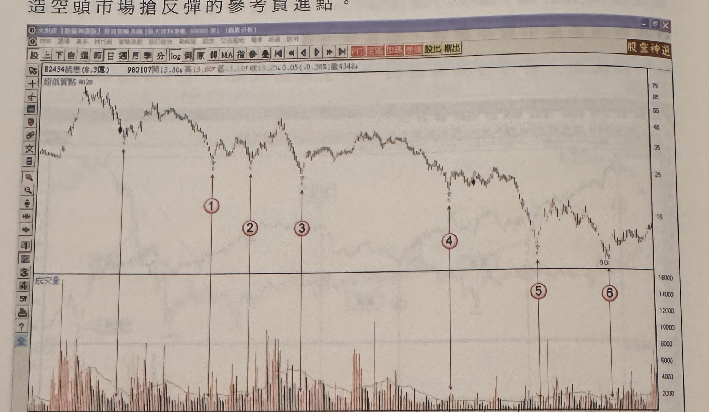
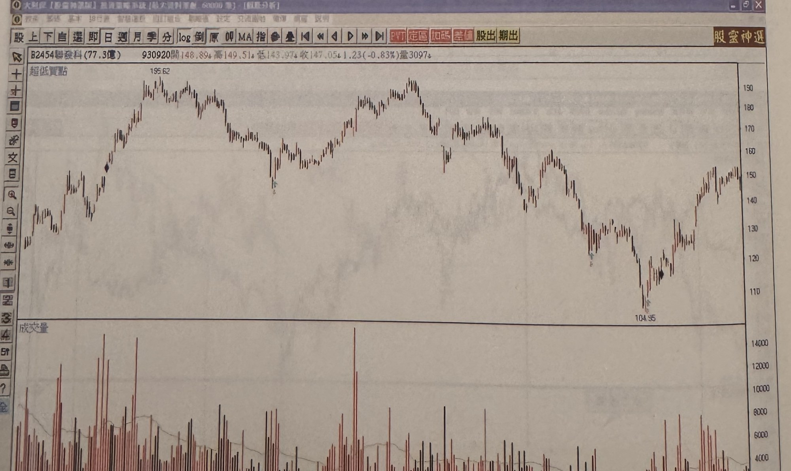

# 附錄——作者自製程式指標摘要

> **重要說明**：本附錄（p.209–212）介紹的四個指標，書中原文明言「介紹本人設計之程式指標，均須透過程式編寫，無法在一般市場簡易股票軟體呈現，故不予詳細解析」（p.209）。也就是說，作者**刻意不公開**這些指標的計算公式、參數設定細節與完整進出場規則。本文件僅摘要書中實際寫到的文字敘述與圖例說明，**規則不完整，無法實作**，不推測任何未明示的公式、門檻或判斷邏輯。以下每個指標段落末皆重申此限制。

## 1. 台指期五分鐘 PVT 通道操作系統（p.209）

**書中原文摘要**：「透過波峰波谷定位，形成漲勢跌勢慣性模型，自動產生操作訊號。」

**圖例摘要**：
- 圖（p.209第一張，無圖號）：台指期近5分鐘K線圖，971028。K線圖上疊加一條階梯狀通道線（PVT通道）。左側高點附近通道線轉折處標示「放空訊號」；價格沿階梯狀通道逐段下移，途中多次跌破通道線；至圖右側低點止跌反彈處標示「平倉反手做多訊號」，通道線隨之轉為上升階梯。

  

- 圖（p.209第二張，無圖號）：台指期近5分鐘K線圖，960911。同樣疊加階梯狀PVT通道線，左側高點通道轉折處標示「放空」，價格下跌至低點通道轉折處標示「買進」，價格上漲至9055高點通道轉折處再標示「放空」，回落至8731低點通道轉折處再標示「買進」。

  

**規則不完整，無法實作**：書中未說明「PVT通道」的計算方式（是否與傳統PVT指標(Price Volume Trend)同名同義、或為作者自訂之波峰波谷定位演算法）、通道階梯的生成邏輯、放空/買進訊號的觸發條件、停損停利規則，僅能由圖例觀察到訊號大致出現在通道線轉折處附近。不予推測其公式。

## 2. 台指期一分鐘差值操作法（p.210）

**書中原文摘要**：「市場走勢80%屬於震盪格局，因此運用DMI趨向指標石筍現象偵測當天走勢的各波極端位置，提供操作訊號，屬於逆勢操作系統。」

**圖例摘要**：
- 圖（p.210第一張，無圖號，標題「差值操作法(加點數)」）：台指期近K線圖，980217。K線圖疊加一條均線，價格於高低點反覆標示「多」「空」，並於部分回檔處標示「平倉」。

  

- 圖（p.210第二張，無圖號，標題同上）：台指期近K線圖，970526。同樣疊加均線，多空標示與平倉標示反覆出現於高低點與回檔處。

  

**規則不完整，無法實作**：書中僅說明此系統的立論基礎與本章第二節「DMI石筍現象」有關（見 `gq-04-02-DMI石筍現象.md`），但「差值」（標題中「加點數」字樣）具體所指為何種計算（例如＋DI與-DI之差值、或加計固定點數之停損停利機制）、多空與平倉訊號的觸發條件、與第二節規則的異同，書中均未說明。不予推測其公式。

## 3. 雙乖離差值指標及買賣訊號（p.211）

**書中原文摘要**：「運用兩條均線軌道的乖離值，區分為多方差值及空差值，當多方差值低於+7顯示價格進入高檔區，可以透過跌破濾網產生放空訊號，而當空方差值回升至-7之上，顯示價格進入低檔區，若符合突破濾網，產生買進訊號。」

已知門檻值（書中明示）：
- 多方差值 < +7 → 價格進入高檔區，需搭配「跌破濾網」才產生放空訊號。
- 空方差值 > -7 → 價格進入低檔區，需搭配「突破濾網」才產生買進訊號。

**圖例摘要**：
- 圖（p.211第一張，無圖號，標題「雙乖訊號51.29」）：茂訊(3213) K線圖。標示紅色圓圈數字於高點處標示「放空」，下跌後於數個止跌反彈處標示「買進」，反彈後再跌處標示「放空」。下方「雙乖離差值」指標圖以黃色帶狀區標示-7～+7濾網區間。

  

- 圖（p.211第二張，無圖號，標題「雙乖訊號」）：欣銓(3264) K線圖。下方指標圖分別標示「多方差值」與「空方差值」兩條曲線，並標示水平參考線「+7」「-7」，以箭頭連接K線圖高低點與指標對應濾網穿越位置。

  

**規則不完整，無法實作**：書中未說明「兩條均線軌道」所用的均線參數（天期）、「多方差值」與「空方差值」的具體計算公式（如何由兩條均線軌道推導出正負兩組差值）、「跌破濾網」與「突破濾網」的具體條件（例如是否比照第四章其他節的「K線收盤突破/跌破前一根K線高低點」邏輯）、以及停損停利規則。僅+7／-7兩個門檻值書中有明示，其餘均無法確認，不予推測。

## 4. 超低買點訊號（p.212）

**書中原文摘要**：「運用成交量及常用指標下探至超賣區的價格特性，創造空頭市場搶反彈的參考買進點。」

**圖例摘要**：
- 圖（p.212第一張，無圖號，標題「超低買點60.29」）：號碼(2434) K線圖。價格自左側高點反覆下跌，形成數個下降波段低點，各相對低點皆標示紅色圓圈數字；下方成交量柱狀圖於各標示點對應處呈現不同程度放大或萎縮。

  

- 圖（p.212第二張，無圖號，標題「超低買點」）：聯發科(2454) K線圖。價格自高點反覆下跌，中途數次反彈後再創新低，下方成交量柱狀圖多處出現放大量峰值，最終於低點止跌反彈。

  

**規則不完整，無法實作**：書中僅泛稱「運用成交量及常用指標」，未指明是哪些「常用指標」（可能與本章第一～三節的乖離率、DMI、威廉指標有關，但書中未明確指出對應關係）、成交量的判定門檻（放大或萎縮的具體比例）、以及買進訊號的觸發條件與停損停利規則。不予推測其公式。

## 總結

本附錄四個指標（PVT通道、一分鐘差值操作法、雙乖離差值指標、超低買點訊號）均為作者自製、須透過程式編寫才能呈現的指標，書中僅提供立論基礎的一句話敘述與範例圖，**未提供計算公式、完整訊號定義、進場、停損、停利規則**，除「雙乖離差值指標」明示的 +7／-7 兩個門檻值外，其餘一律規則不完整，無法實作。若未來取得作者原始程式碼或更完整的說明文件，應另行補充；在缺乏原始資料的情況下，不應依此附錄自行推測公式並用於實際交易。

## 原文出處

- `extracted/pages/IMG_8711.md`（p.209）
- `extracted/pages/IMG_8712.md`（p.210）
- `extracted/pages/IMG_8713.md`（p.211）
- `extracted/pages/IMG_8714.md`（p.212）

（p.205–208為後記，原書未拍照，不屬本附錄內容，不列為缺頁。）
